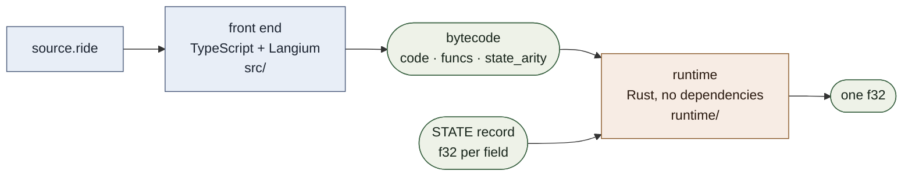
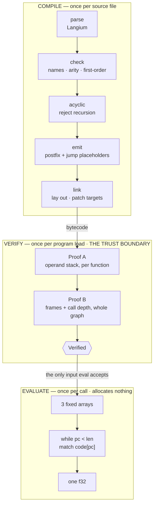
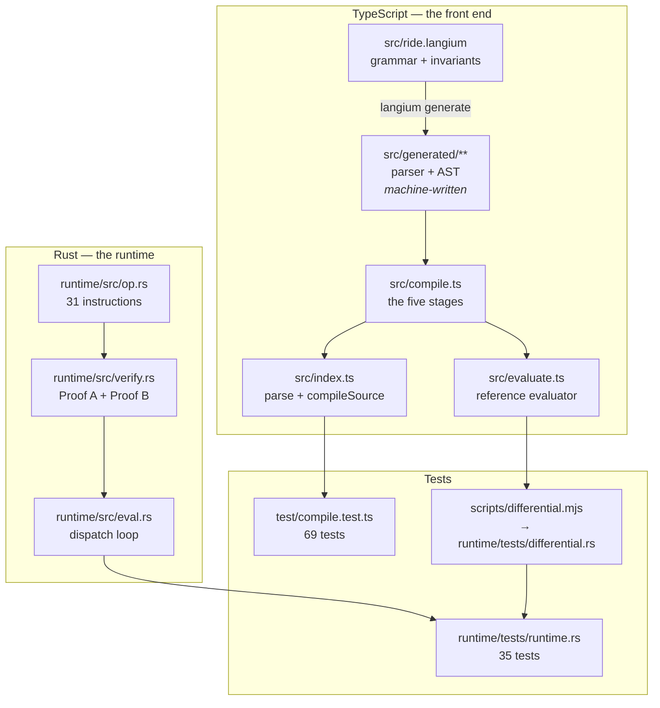

*ride Handbook · Part 1 of 9 — Overview*

# The map

**Everything that `ride` is, and the one seam between its two halves.** This part gives the shape
of the system. It makes no claim that a later part does not prove.

[Index](README.md) · **1 Overview** · [2 Language](02-language.md) ·
[3 Compiler](03-compiler.md) · [4 Bytecode](04-bytecode.md) ·
[5 Verification](05-verification.md) · [6 Runtime](06-runtime.md) ·
[7 Testing](07-testing.md) · [8 Recipes](08-recipes.md) · [9 Roadmap](09-roadmap.md)

---

## Contents

- [01 · What the language computes](#01--what-the-language-computes)
- [02 · The two halves, and the one artifact between them](#02--the-two-halves-and-the-one-artifact-between-them)
- [03 · The three lifecycle bands](#03--the-three-lifecycle-bands)
- [04 · The four invariants](#04--the-four-invariants)
- [05 · Values that live in two places](#05--values-that-live-in-two-places)
- [06 · The file map](#06--the-file-map)
- [07 · The one open decision](#07--the-one-open-decision)

---

## 01 · What the language computes

A `ride` program is a mathematical function. It takes a record of numbers and returns one number.

```ride
state { s }                              // the record the host supplies

let phase x = 0.6133x - 220.788          // a named function

let main =                               // the entry point, no parameters
    if s < 345 then 350.1
    else if s < 360 then 0.9267s + 30.3885
    else if s < 570 then s + 5 - cos(phase(s))
    else 1.2933s - 161.181
```

That is the whole language. There are no strings. There are no collections. There are no effects.
Nothing is carried between calls.

**This is not an animation system and not a renderer.** It computes numbers. A host that animates
something calls the program once per value and does the animation itself.

---

## 02 · The two halves, and the one artifact between them

The project has two halves in two languages. One artifact passes between them: **bytecode**.



**Fig 1** The runtime never parses. The front end is the only parser in the project, which is why
`runtime/Cargo.toml` can list no dependency outside the optional `wasm` feature.
`src/index.ts:71` · `runtime/src/lib.rs:42`

The seam matters more than the halves. A reader who treats this as one program will not understand
why Part 5 exists.

> ### Why the runtime re-checks what the compiler just produced
>
> The compiler already rejects a recursive program by name (`src/compile.ts:151`). The runtime
> then rejects it again, by cycle detection on the call graph (`runtime/src/verify.rs:344`). That
> looks like duplicated work.
>
> It is not. **Bytecode can reach the runtime without passing through the compiler.** It can come
> from a file, from a network, or from an older version of the front end. The runtime's evaluator
> indexes its arrays with no run-time guard, so a malformed program would read out of bounds.
>
> So the two layers have two different jobs. The compiler's checks serve the author and give good
> messages. The runtime's proofs serve the machine and give a safety guarantee.
> `src/compile.ts:151` · `runtime/src/verify.rs:108`

---

## 03 · The three lifecycle bands

Split the system by **when the code runs**, not by which folder holds it. Three bands.



**Fig 2** `Verified` is a type that only `verify` can build, so holding one is the proof that
evaluation is safe. The evaluator takes nothing else.
`runtime/src/eval.rs:51` · `runtime/src/eval.rs:58`

| Band | Runs | Allocates | Takes untrusted input | Part |
|------|------|-----------|-----------------------|------|
| Compile | Once per source file | Freely | No. The author wrote the source. | [3](03-compiler.md) |
| Verify | Once per program load | One `Vec` per function, then drops it | **Yes. This is the trust boundary.** | [5](05-verification.md) |
| Evaluate | Once per call | **Nothing** | No. `Verified` already proved it. | [6](06-runtime.md) |

The middle band is the one a new reader will merge into the first. Keep it separate. It is the only
band that assumes its input is hostile.

---

## 04 · The four invariants

Four properties of the language are load-bearing. Each buys a guarantee that a later part depends
on. A change that breaks one invalidates a proof.

| Invariant | What it means | What it buys | What breaks without it |
|-----------|---------------|--------------|------------------------|
| **First-order** | A function is never a value. No lambda. A parameter is always a number. | Every call is direct and saturated. No closure to allocate. Implicit multiplication is unambiguous. | A closure representation, so a heap, so a collector. And `15exp(x)` becomes ambiguous. |
| **Strict** | Call by value. Operands run before the operation that consumes them. | The reading order is the evaluation order. | A thunk representation. Laziness needs a heap. |
| **No recursion** | The call graph is acyclic. | The frame array is sized at compile time. Proof B is possible. | Proof B has no bound. Frame use becomes unknown. |
| **Total branches** | Every `if` has an `else`. | Both arms leave the stack at the same height. Proof A can check the join. | An arm that produces no value. Proof A fails at the join. |

Part 2 §06 shows where each invariant appears in the grammar. Part 5 shows which proof each one
serves.

> ### Why implicit multiplication is legal here and not in most ML languages
>
> `ride` accepts `15exp(-x)` and `4.9(u^2)`. A number next to a term means multiplication.
>
> In a normal ML this is ambiguous, because `f x` applies `f` to `x`. So `15 exp(x)` would read as
> an application of `15`.
>
> **The first-order invariant removes the ambiguity.** A function is never a value, so application
> is always written with parentheses — `f(a, b)`. Juxtaposition can therefore have no other
> meaning, and the grammar reads it as multiplication.
>
> Curried application is the feature that would break this. Do not add it. The grammar header says
> so at `src/ride.langium:26`.

---

## 05 · Values that live in two places

The project is polyglot. Some facts are stated in both TypeScript and Rust. A silent second copy
is the worst trap for a reader who traces by hand, so every duplicate is listed here.

| Value | Home A (TypeScript) | Home B (Rust) | Risk when they drift |
|-------|---------------------|---------------|----------------------|
| The instruction set | `src/compile.ts:37` | `runtime/src/op.rs:20` | A new instruction in one half only. The front end emits an instruction the runtime cannot read, and the failure is a decode error with no obvious cause. |
| The twelve builtins and their arity | `src/compile.ts:84` | `runtime/src/eval.rs:149-221` | An arity that disagrees. The compiler accepts three arguments, the evaluator pops two, and every later value on the stack shifts. |
| Evaluator semantics | `src/evaluate.ts:28` | `runtime/src/eval.rs:83` | The two give different numbers for the same program. The differential harness in Part 7 exists for this row. |
| `step` and `mix` definitions | `src/evaluate.ts` (the `Step` and `Mix` arms) | `runtime/src/eval.rs:186` and `:194` | A boundary that moves from `<` to `<=`. Every program that uses `step` changes behaviour at one point. |
| The `f32` width | `Math.fround`, `src/evaluate.ts:18` | `f32` throughout | The reference evaluator computes in `f64` and the two halves drift on every arithmetic result. |

> ### The duplicate the differential harness does not catch
>
> Part 7 describes a harness that compiles every example, records what the TypeScript evaluator
> returns, and checks the Rust runtime against it. That protects row 3 of the table above.
>
> **It does not protect row 4.** A mutation test changed the `step` boundary in
> `runtime/src/eval.rs:186` from `x < edge` to `x <= edge`. The differential tests still passed.
> The reason is simple: neither example program uses `step`.
>
> The unit tests did catch it, at `runtime/tests/runtime.rs` in
> `step_and_mix_keep_their_published_meaning`. So the protection is real, and it comes from the
> unit test and not from the harness.
>
> **The rule this gives:** the differential harness covers only what the examples exercise. An
> instruction with no example needs a unit test that pins its published meaning.

---

## 06 · The file map



**Fig 3** `src/generated/**` is written by `npm run langium:generate` and is committed. An edit to
`src/ride.langium` without that command leaves the tests passing against a grammar that is no
longer the source of truth. `langium-config.json:8` · `package.json:18`

| File | Lines | Inputs | What it produces |
|------|-------|--------|------------------|
| `src/ride.langium` | 114 | — | The grammar. Its header states the four invariants. |
| `src/compile.ts` | 465 | AST | `Bytecode`, or a list of `Diagnostic` |
| `src/index.ts` | 75 | source text | `CompileResult`. The only call a host needs. |
| `src/evaluate.ts` | 173 | `Bytecode` + state | One number. A reference, not the shipped path. |
| `runtime/src/op.rs` | 116 | — | The instruction set, `Func`, `Program` |
| `runtime/src/verify.rs` | 405 | `Program` | `Bounds`, or a `VerifyError` |
| `runtime/src/eval.rs` | 297 | `Verified` + state | One `f32` |

---

## 07 · The one open decision

**The language has one number type.** The grammar declares one numeric terminal at
`src/ride.langium:112`. The runtime uses `f32` throughout.

A separate `int` type is **not** a small addition. It is a one-way door, and the owner decides it.

| Option | What it costs | What it gives |
|--------|---------------|---------------|
| Keep one number type | No integer semantics. `1/3` is `0.333…`, never `0`. | The runtime stays free of trap paths. |
| Add `int`, forbid integer division | Every arithmetic operation and literal changes. | No trap, and real integer semantics elsewhere. |
| Add `int`, define division to return a value | The same change, plus a rule nobody expects (`1/0 = ?`). | No trap. |
| Add `int`, prove the divisor is non-zero | The same change, plus a dataflow analysis in the compiler. | No trap, and no surprising rule. |

The reason this is a door and not a window: **`f32` division by zero gives an infinity, but
integer division traps.** In WebAssembly, `i32.div_s` traps on divide-by-zero and on
`MIN / -1`. A trap is a panic on the evaluation path, and `CLAUDE.md` §10 commitment 8 forbids
one.

The decision also fixes the value representation. One number type needs no tag. Two number types
need a tag, or two separate instruction families.

**Recommendation:** keep one number type until a real program needs integer semantics. The surface
syntax leaves room for the ML answer — distinct operators per type, `+` against `+.` — so the
upgrade path stays open.

---

> Sources read for this part: `src/ride.langium`, `src/compile.ts`, `src/index.ts`,
> `src/evaluate.ts`, `runtime/src/op.rs`, `runtime/src/verify.rs`, `runtime/src/eval.rs`,
> `runtime/tests/runtime.rs`, `langium-config.json`, `package.json`, and `CLAUDE.md` §10. The
> `step` mutation result in §05 was produced by changing `runtime/src/eval.rs:186` and running
> `cargo test`. Line references point at the source as read on **2026-10-03**.
> **Names and rules are stable. Line numbers move.**
