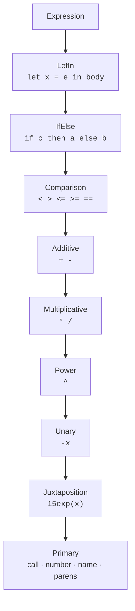

*ride Handbook · Part 2 of 9 — The language*

# Grammar and surface syntax

**Every form the language accepts, and where each invariant appears in the grammar.** This part
describes the surface only. Part 3 describes what the compiler does with it.

[Index](README.md) · [1 Overview](01-overview.md) · **2 Language** ·
[3 Compiler](03-compiler.md) · [4 Bytecode](04-bytecode.md) ·
[5 Verification](05-verification.md) · [6 Runtime](06-runtime.md) ·
[7 Testing](07-testing.md) · [8 Recipes](08-recipes.md) · [9 Roadmap](09-roadmap.md)

---

## Contents

- [01 · A complete program](#01--a-complete-program)
- [02 · Declarations](#02--declarations)
- [03 · Expressions](#03--expressions)
- [04 · Operator precedence](#04--operator-precedence)
- [05 · The twelve builtins](#05--the-twelve-builtins)
- [06 · Where the invariants live in the grammar](#06--where-the-invariants-live-in-the-grammar)
- [07 · Terminals and comments](#07--terminals-and-comments)
- [08 · What the grammar accepts and the compiler ignores](#08--what-the-grammar-accepts-and-the-compiler-ignores)

---

## 01 · A complete program

Every program has one `state` declaration and one function named `main`. `main` takes no
parameters, because its input is the STATE record.

```ride
// examples/projectile.ride

state { t }

let launch_speed_to_peak peak = sqrt(19.6 peak)

let arc e0 v0 u = e0 + v0 u - 4.9(u^2)

let main =
    let u = clamp(t / 3, 0, 1) in
    if u < 1 then arc(2, launch_speed_to_peak(20), u)
    else 2
```

Read three things from it. `19.6 peak` is implicit multiplication. `arc` takes three parameters
and is called with three arguments. `let u = … in` binds a value once, and the body reads it.

---

## 02 · Declarations

Three forms appear at the top level. `src/ride.langium:40`

### `state { … }`

```ride
state { s, t, clock }
```

The record the host supplies. **Field order is the wire order.** The host writes the fields in
this order, and the instruction `LoadState(i)` reads the i-th one.
`src/ride.langium:45`

| Rule | Where it is checked | What it rejects |
|------|---------------------|-----------------|
| At most one `state` declaration | `src/compile.ts:126` | A second declaration, which would make the field order ambiguous |
| No duplicate field name | `src/compile.ts:130` | `state { x, x }`, where `LoadState` could mean either slot |

A program with no `state` declaration is legal. It is then a constant function.

### `let <name> <params…> = <expr>`

```ride
let phase x = 0.6133x - 220.788
let main = phase(10)
```

A named function. Parameters are written bare and juxtaposed. `src/ride.langium:60`

**The declaration syntax does not make the language curried.** A call site always uses
parentheses. §06 explains why that distinction carries the implicit-multiplication rule.

| Rule | Where it is checked | What it rejects |
|------|---------------------|-----------------|
| No duplicate function name | `src/compile.ts:135` | Two `let f` declarations, where a call could mean either |
| No duplicate parameter name | `src/compile.ts:239` | `let f a a = a`, where a frame slot could mean either |
| `main` must exist | `src/compile.ts:143` | A program with no entry point |
| `main` takes no parameters | `src/compile.ts:146` | `let main a = a`, which has no caller to supply `a` |

### `import { … } from "<path>"`

```ride
import { spring, lerp } from './lib/fn.ride'
```

The grammar accepts this form. `src/ride.langium:53`

**The compiler does not follow it.** See §08.

---

## 03 · Expressions



**Fig 1** The chain is the precedence ladder, loosest at the top. Each rule delegates to the next,
so a `let` body can hold anything and a `Primary` can hold a parenthesised `let`.
`src/ride.langium:66-106`

### `let … in` — a local binding

```ride
let u = (s - 570) / 3 in
2 + 25.7u - 4.9(u^2)
```

The binding is scoped to the body. `src/ride.langium:71`

Two reasons to use it, and the first is the stronger one.

1. **It removes a second copy of a value.** `(s - 570) / 3` written twice is two places for the
   same number to go stale. Change the `570` in one copy and the result is wrong in a way that
   still compiles.
2. **It computes the value once.** The arm above costs 19 instructions with the subexpression
   written twice, and 17 with the binding. That saving is small. Do not use it as the argument.

A local shadows a state field of the same name. `src/compile.ts:255`

### `if … then … else …`

```ride
if s < 345 then 350.1 else 1.2933s - 161.181
```

**The `else` is mandatory.** `src/ride.langium:76`

A branch with no `else` could produce no value. Part 5 §02 shows the proof that this requirement
serves: both arms must leave the operand stack at the same height, and an arm that produces
nothing has a different height.

Chain the form for more arms:

```ride
if s < 345 then 350.1
else if s < 360 then 0.9267s + 30.3885
else if s < 570 then s + 5 - cos(phase(s))
else 1.2933s - 161.181
```

### `f(a, b)` — a call

```ride
arc(2, launch_speed_to_peak(20), u)
```

Parentheses are required. This is the only application form in the language.
`src/ride.langium:103`

### Implicit multiplication

```ride
15exp(-1.2 t)      // 15 * exp(-1.2 * t)
4.9(u^2)           // 4.9 * (u ^ 2)
19.6 peak          // 19.6 * peak
```

A term next to a term means multiplication. `src/ride.langium:99`

---

## 04 · Operator precedence

Loosest first. Every row cites the grammar rule that sets it.

| Level | Operators | Associativity | Grammar |
|-------|-----------|---------------|---------|
| 1 | `let … in` | — | `src/ride.langium:71` |
| 2 | `if … then … else` | — | `src/ride.langium:76` |
| 3 | `<` `>` `<=` `>=` `==` | **None.** `a < b < c` is a syntax error. | `src/ride.langium:81` |
| 4 | `+` `-` | Left | `src/ride.langium:84` |
| 5 | `*` `/` | Left | `src/ride.langium:87` |
| 6 | `^` | **Right.** `2^3^2` is `2^(3^2)` = 512. | `src/ride.langium:91` |
| 7 | unary `-` | Prefix | `src/ride.langium:94` |
| 8 | juxtaposition | Left | `src/ride.langium:99` |
| 9 | call · number · name · `( … )` | — | `src/ride.langium:102` |

> ### Comparison is not chainable, and that is deliberate
>
> `src/ride.langium:81` uses `?` and not `*`. So the rule accepts **at most one** comparison
> operator.
>
> `1 < 2 < 3` is therefore a syntax error, not a silently grouped expression. In a language that
> chained it left, `1 < 2 < 3` would evaluate as `(1 < 2) < 3`, which is `1 < 3`, which is `1`.
> That result is true for the wrong reason and gives no warning.
>
> A rejected program is cheaper than a program that computes the wrong number.

---

## 05 · The twelve builtins

Six take one argument, three take two, two take three, and one takes four.
`src/compile.ts:84`

| Builtin | Arity | Definition | Note |
|---------|-------|------------|------|
| `sin(x)` | 1 | sine, radians | |
| `cos(x)` | 1 | cosine, radians | |
| `sqrt(x)` | 1 | square root | A negative argument gives `NaN`. No check. |
| `abs(x)` | 1 | absolute value | |
| `sign(x)` | 1 | `-1`, `0`, or `1` | **`sign(0)` is `0`.** See the note below. |
| `exp(x)` | 1 | e to the power x | |
| `max(a, b)` | 2 | the larger | |
| `min(a, b)` | 2 | the smaller | |
| `step(edge, x)` | 2 | `0.0` when `x < edge`, else `1.0` | `runtime/src/eval.rs:186` |
| `mix(a, b, t)` | 3 | `(1 - t) * a + t * b` | A linear blend. `runtime/src/eval.rs:194` |
| `clamp(x, lo, hi)` | 3 | `x` held inside `[lo, hi]` | `runtime/src/eval.rs:203` |
| `select(edge, x, a, b)` | 4 | `a` when `x < edge`, else `b` | `runtime/src/eval.rs:211` |

> ### `sign(0)` is zero, and the Rust standard library disagrees
>
> Rust's `f32::signum` returns `1.0` for positive zero. That is not the sign function this
> language means, so `runtime/src/eval.rs:165` tests for zero first and returns `0.0`.
>
> The test `sign_of_zero_is_zero` in `runtime/tests/runtime.rs` pins this. Without it a later
> simplification to `x.signum()` would look correct and change every program that reads
> `sign(0)`.

### `step`, `mix` and `select` encode a choice as arithmetic

These three compute a branch without taking one. `mix(a, b, step(e, x))` gives `a` when
`x < e`, and `b` otherwise.

They are in the language because the instruction set carries them. **Prefer `if` for a real
choice.** The arithmetic form computes every arm on every call, including the arm it discards. A
real branch evaluates one arm.

---

## 06 · Where the invariants live in the grammar

Part 1 §04 names four invariants. Each one is a specific absence or a specific requirement in
`src/ride.langium`.

| Invariant | Where in the grammar | What enforces it |
|-----------|----------------------|------------------|
| **First-order** | No lambda rule exists. `Param` is a bare `name=ID` at `:63`. The only application form is `ID '(' args ')'` at `:103`. | The grammar cannot express a function value. The compiler also rejects a mention of a function name outside a call, at `src/compile.ts:271`. |
| **Strict** | Not in the grammar. There is no `lazy` form and no thunk syntax. | The evaluator. `runtime/src/eval.rs:83` evaluates operands before the operation. |
| **No recursion** | Not in the grammar. The grammar cannot express the restriction. | Two layers: `src/compile.ts:417` finds the cycle by name, and `runtime/src/verify.rs:344` rejects it on the call graph. |
| **Total branches** | `IfElse` at `:76` requires `'else' whenFalse=Expression`. There is no optional-else alternative. | The grammar. A missing `else` is a parse error. |

> ### Two invariants the grammar cannot state
>
> **Strictness** and **no recursion** are absent from the grammar on purpose. A grammar describes
> shape. Neither property is a shape.
>
> Strictness is a property of the evaluator. Recursion is a property of the whole call graph, and
> a rule in `src/ride.langium` can see only one declaration at a time.
>
> So both live where they can be checked. This is why `src/compile.ts:417` exists, and why
> `runtime/src/verify.rs:344` exists even though the compiler already checked. Part 1 §02 gives
> the reason for the second copy.

---

## 07 · Terminals and comments

```
hidden terminal WS:         /\s+/              src/ride.langium:108
hidden terminal ML_COMMENT: /\/\*[\s\S]*?\*\// src/ride.langium:109
hidden terminal SL_COMMENT: /\/\/[^\n\r]*/     src/ride.langium:110

terminal NUMBER:            /[0-9]+(\.[0-9]+)?/  src/ride.langium:112
terminal ID:                /[_a-zA-Z][\w_]*/    src/ride.langium:113
terminal STRING:            /"[^"]*"|'[^']*'/    src/ride.langium:114
```

| Terminal | What it accepts | What it rejects, and the consequence |
|----------|-----------------|-------------------------------------|
| `NUMBER` | `0`, `1`, `3.14`, `220.788` | No sign, no exponent. `-5` is unary minus applied to `5`. `1e6` does not parse — write `1000000`. |
| `ID` | `s`, `_clock`, `phase2` | No leading digit. A leading underscore is allowed and carries no special meaning to the compiler. |
| `STRING` | Either quote style | Used only by `import`, which the compiler ignores. See §08. |

> ### `1e6` parses, and it does not mean a million
>
> `src/ride.langium:112` accepts digits and one optional decimal point. There is no exponent
> form.
>
> The interesting part is that `1e6` **does not fail at the lexer**. `NUMBER` matches `1`, `ID`
> matches `e6`, and the juxtaposition rule at `:99` reads the pair as multiplication. So `1e6`
> compiles as `1 * e6` and the error is:
>
> ```
> unknown name `e6`
> ```
>
> That message is true and it does not name the cause. Worse, a program that happens to declare
> `e6` gets a different error again — the first-order rule, because `e6` is then a function:
>
> ```
> `e6` is a function, so it cannot be used as a value. ride is first-order: write `e6(…)` to call it.
> ```
>
> **This is the cost of implicit multiplication, and it is a real cost.** Write large constants
> in full: `1000000` parses and gives the expected value. Part 9 lists an exponent form as a
> to-do item.

## 08 · What the grammar accepts and the compiler ignores

One form parses and then does nothing.

```ride
import { spring, lerp } from './lib/fn.ride'    // parses. Has no effect.
```

`src/ride.langium:53` defines `ImportDecl`. `src/compile.ts:120` never reads it. The declaration
list is filtered for `StateDecl` at `:124` and for `FunDecl` at `:134`, and `ImportDecl` is not
collected at all.

So a program with an `import` compiles, and the imported names are then **unknown names**:

```
unknown function `spring`
```

**For a new joiner:** this is the first trap you will hit. The message does not say the import was
ignored. It says the name is unknown, which is true but not the cause.

Part 9 lists multi-file resolution as a to-do item with its design question attached.

---

> Sources read for this part: `src/ride.langium` in full, `src/compile.ts` lines 84–160 and
> 225–400, `runtime/src/eval.rs` lines 149–221, `runtime/tests/runtime.rs`, and
> `examples/projectile.ride`. The precedence table in §04 was derived from the delegation chain
> in the grammar, not from a comment. The `import` behaviour in §08 was checked by reading which
> declaration types `src/compile.ts:120` filters for. Line references point at the source as read
> on **2026-10-03**. **Names and rules are stable. Line numbers move.**
