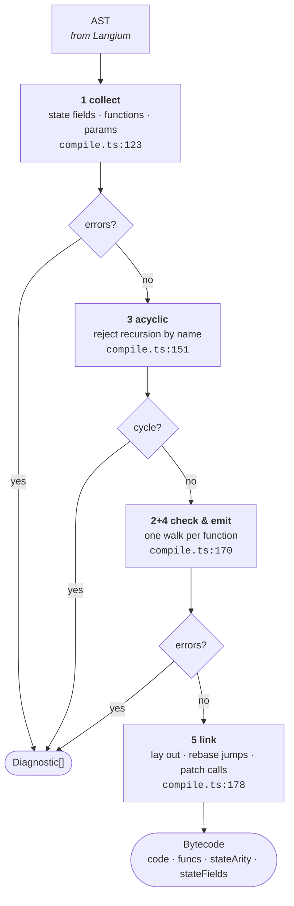
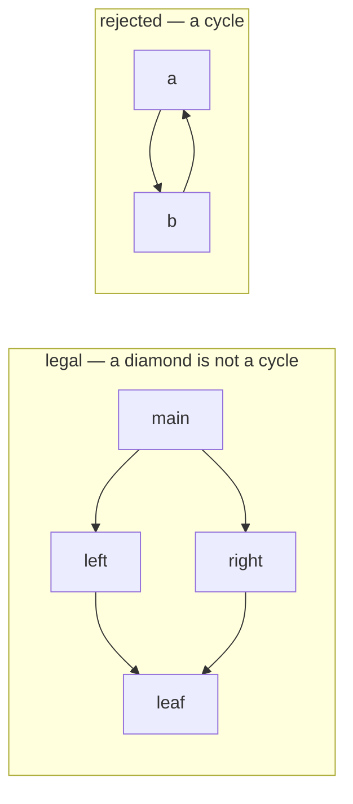
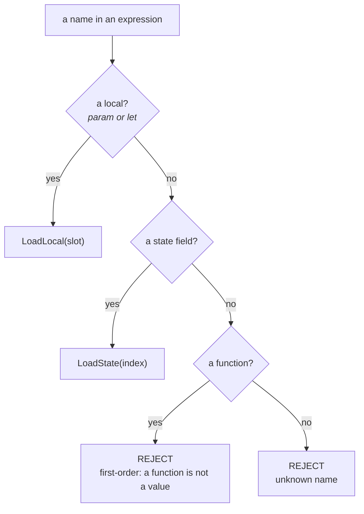
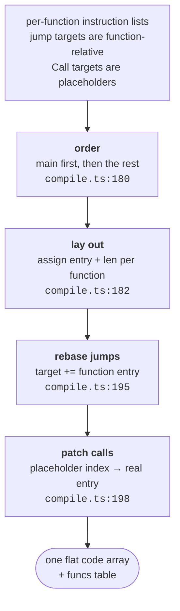

*ride Handbook · Part 3 of 9 — The compiler*

# The compile band

**Everything that happens once per source file.** This part follows one program from text to
bytecode. It allocates freely, and it produces diagnostics rather than throwing.

[Index](README.md) · [1 Overview](01-overview.md) · [2 Language](02-language.md) ·
**3 Compiler** · [4 Bytecode](04-bytecode.md) ·
[5 Verification](05-verification.md) · [6 Runtime](06-runtime.md) ·
[7 Testing](07-testing.md) · [8 Recipes](08-recipes.md) · [9 Roadmap](09-roadmap.md)

---

## Contents

- [01 · The five stages](#01--the-five-stages)
- [02 · Stage 1 · collect](#02--stage-1--collect)
- [03 · Stage 3 · acyclic, and why it runs third](#03--stage-3--acyclic-and-why-it-runs-third)
- [04 · Stages 2 and 4 · check and emit](#04--stages-2-and-4--check-and-emit)
- [05 · How each form is emitted](#05--how-each-form-is-emitted)
- [06 · Frame layout](#06--frame-layout)
- [07 · Stage 5 · link](#07--stage-5--link)
- [08 · A worked compile](#08--a-worked-compile)
- [09 · The diagnostic contract](#09--the-diagnostic-contract)

---

## 01 · The five stages

`compile` takes a parsed AST and returns bytecode or a list of diagnostics.
`src/compile.ts:120`



**Fig 1** The stage numbers are not the execution order. `acyclic` runs before `check` because it
needs only names, and a cycle makes every later diagnostic noise.
`src/compile.ts:151`

| Stage | Reads | Writes | Rejects |
|-------|-------|--------|---------|
| 1 collect | AST declarations | field names, a name→declaration map | duplicate names, a missing or parameterised `main`, two `state` declarations |
| 3 acyclic | the name map | nothing | a cycle in the call graph, named |
| 2+4 check and emit | one function body | that function's instructions | unknown names, wrong arity, a function used as a value, a number called as a function |
| 5 link | every function's instructions | one `code` array and a `funcs` table | nothing. Stage 5 cannot fail. |

> ### Stage 4 does not simplify the arithmetic
>
> The compiler lowers and emits. It does not distribute, collect terms, or fold constants. The
> shape the author wrote is the shape that runs.
>
> That looks like a missed optimisation. It is a deliberate choice with a stated cost.
>
> An algebraic simplifier reassociates. `f32` addition is **not** associative, so
> `(a + b) + c` and `a + (b + c)` can differ in the last bit. A reader who compares the source to
> the behaviour would then have to account for the difference, and that cost is paid on every
> future read.
>
> `CLAUDE.md` §10 commitment 7 records the rule and the gate it would need: a simplifier must come
> with a bit-for-bit comparison of both paths over every example.

---

## 02 · Stage 1 · collect

Gather what the later stages index by. `src/compile.ts:123`

```
stateFields  : string[]              declaration order = wire order
byName       : Map<string, FunDecl>  every top-level function
entry        : FunDecl               the one named `main`
```

| Check | Line | Message |
|-------|------|---------|
| One `state` declaration at most | `src/compile.ts:126` | `more than one \`state\` declaration` |
| No duplicate state field | `src/compile.ts:130` | `duplicate state field \`x\`` |
| No duplicate function | `src/compile.ts:135` | `duplicate function \`f\`` |
| `main` exists | `src/compile.ts:143` | `no \`let main = …\` to start from` |
| `main` has no parameters | `src/compile.ts:146` | ``\`main\` takes its input from `state`, so it must have no parameters`` |

Stage 1 returns early when it finds any error. A later stage would index a map that stage 1 could
not build.

---

## 03 · Stage 3 · acyclic, and why it runs third

`findCycle` walks the call graph by name, with three colours. `src/compile.ts:417`



**Fig 2** Two functions may call one shared function. That is a DAG, and Part 5 §03 bounds it. Two
functions that call each other have no frame bound at all.
`src/compile.ts:417` · `runtime/tests/runtime.rs` (`rejects_a_call_graph_cycle`)

The message names the cycle:

```
`f` is recursive (f → f). ride forbids recursion: an acyclic call graph is what
makes the frame bound provable at compile time.
```

> ### Why the compiler reports a cycle the runtime will catch anyway
>
> `runtime/src/verify.rs:344` detects the same cycle. So this stage looks redundant.
>
> The difference is the message. The compiler holds the **names**, so it can say
> `a → b → a`. The runtime holds only instruction indices, so the best it can report is
> `call_graph_cycle`.
>
> Part 1 §02 gives the other half of the reason: the runtime's copy is not for the author. It is
> for bytecode that never passed through this compiler.

`findCycle` reports one cycle and stops. `src/compile.ts:159` breaks the loop. A second report
would name an overlapping path and add nothing.

---

## 04 · Stages 2 and 4 · check and emit

`emitFunction` walks one function body and appends instructions. Checking and emission share one
pass, because both need the same scope information. `src/compile.ts:225`

Name resolution is lexical, and the order is fixed. `src/compile.ts:254`



**Fig 3** A local shadows a state field, and a state field shadows nothing. The third branch is the
first-order invariant doing real work: the name exists, and using it here is still an error.
`src/compile.ts:254-282`

The two first-order diagnostics read differently on purpose:

| Source | Message | Line |
|--------|---------|------|
| `let g x = x` then `g + 1` | ``\`g\` is a function, so it cannot be used as a value. ride is first-order: write `g(…)` to call it.`` | `src/compile.ts:271` |
| `let apply f = f(1)` | ``\`f\` is a number, not a function. ride is first-order, so only a declared function can be called.`` | `src/compile.ts:360` |

Both name the rule, not only the fault. A reader who hits either one learns the invariant.

---

## 05 · How each form is emitted

Postfix. Operands first, then the operation that consumes them.

| Form | Instructions | Line |
|------|--------------|------|
| `3.14` | `Push(3.14)` | `src/compile.ts:249` |
| a local name | `LoadLocal(slot)` | `src/compile.ts:258` |
| a state field | `LoadState(index)` | `src/compile.ts:263` |
| `-x` | `<x>` `Neg` | `src/compile.ts:283` |
| `a b` (juxtaposition) | `<a>` `<b>` `Mul` | `src/compile.ts:289` |
| `a + b` | `<a>` `<b>` `Add` | `src/compile.ts:296` |
| `a < b` | `<a>` `<b>` `Lt` | `src/compile.ts:296` |
| `let x = e in body` | `<e>` `StoreLocal(slot)` `<body>` | `src/compile.ts:308` |
| `if c then a else b` | see below | `src/compile.ts:321` |
| `f(a, b)` | `<a>` `<b>` `Call{…}` | `src/compile.ts:340` |
| `sin(x)` | `<x>` `Sin` | `src/compile.ts:342` |

### The branch shape

`src/compile.ts:321` emits five parts and patches two jump targets afterwards.

```
      <condition>
      JumpIfFalse  → else          emitted with target -1, patched later
      <whenTrue>
      Jump         → join          emitted with target -1, patched later
else: <whenFalse>
join:
```

`patch` writes the real target once the arm length is known. `src/compile.ts:401`

Both jumps go **forward**. Nothing in the emitter can produce a backward jump, because a target is
always `code.length` at a point after the placeholder. Part 5 §04 explains why the runtime still
checks.

---

## 06 · Frame layout

Each function has one frame window. Parameters come first, then one slot per `let`.
`src/compile.ts:229`

```
   let f a b = let u = a + b in let v = u * 2 in u + v

   frame window for f:
   ┌────────┬────────┬────────┬────────┐
   │ slot 0 │ slot 1 │ slot 2 │ slot 3 │
   │   a    │   b    │   u    │   v    │
   └────────┴────────┴────────┴────────┘
     params ─────────┘  lets ──────────┘
   arity = 2                   frame = 4
```

Slots are assigned in source order and are never reused. Two `let` bindings in two different
branch arms still get two slots. `src/compile.ts:311`

That wastes a slot. The cost is bounded by `MAX_FRAME`, which is 64. The alternative is liveness
analysis, and Part 9 lists it as a to-do with its real justification: a program that exceeds 64
slots, which none does yet.

> ### `fpDelta` is the caller's frame size, not the callee's
>
> A `Call` instruction carries three immediates. Two are obvious. `fpDelta` is not.
>
> `src/compile.ts:394` sets it to the **caller's** own frame size, after the whole body is walked.
> The reason is the layout rule above: the callee's window begins just above the caller's. So the
> evaluator computes `fp += fp_delta` and needs no frame-size table at run time.
> `runtime/src/eval.rs:258`
>
> **Why it is patched at the end and not at the call site.** A `let` deep inside a branch arm can
> still widen the window after the call has been emitted. A value written at the call site would
> be stale. `src/compile.ts:394` loops over the finished instruction list and writes the final
> number into every `Call`.
>
> `runtime/src/verify.rs` checks this. A `fp_delta` that disagrees with the caller's declared
> frame is rejected as `frame_delta_mismatch`.

---

## 07 · Stage 5 · link

Three jobs. `src/compile.ts:178`



**Fig 4** `main` is placed first because the runtime starts at `funcs[0]`. Any other order would
run the wrong function. `src/compile.ts:180` · `runtime/src/eval.rs:91`

Stage 5 cannot fail. Every name was resolved in stage 1, and every jump target was patched in
stage 4.

---

## 08 · A worked compile

Source:

```ride
state { s }
let main = if s < 10 then 1 else 2
```

Bytecode, as `test/compile.test.ts` asserts it exactly:

```
  idx  instruction           height after    what
   0   LoadState(0)               1          read s
   1   Push(10)                   2
   2   Lt                         1          s < 10 → 1.0 or 0.0
   3   JumpIfFalse(6)             0          pops the test; → else arm
   4   Push(1)                    1          then arm
   5   Jump(7)                    1          → join
   6   Push(2)                    1          else arm
   7   Ret                        1          one live result
```

Read two things from the height column. The `JumpIfFalse` at index 3 leaves height **0**, which is
the height both arms begin at. The `Jump` at index 5 leaves height **1**, which is the height the
`Ret` at index 7 needs. Part 5 §02 turns that observation into the proof.

Both jump targets are greater than their own index. The test asserts that for every jump in the
program.

---

## 09 · The diagnostic contract

The compiler returns diagnostics. It does not throw on bad input. A throw means a compiler bug.
`src/compile.ts:77`

```ts
type CompileResult =
    | { ok: true; bytecode: Bytecode }
    | { ok: false; errors: Diagnostic[] };
```

| Rule | Why |
|------|-----|
| A diagnostic states what is wrong **and** what the rule is | A reader who hits the message learns the invariant. The two first-order messages in §04 are the standard to match. |
| A syntax error becomes a diagnostic too | `src/index.ts:56` converts Langium lexer and parser errors into the same shape, so a host handles one type. |
| Errors accumulate inside a stage | One bad name does not hide the next. The walk pushes `Push(0)` to keep the stack shape and continues. `src/compile.ts:277` |
| A stage boundary returns early | Stage 2 cannot index a map that stage 1 failed to build. |

> ### Why a rejected name still emits an instruction
>
> `src/compile.ts:277` pushes `Push(0)` after reporting an unknown name.
>
> That looks like it would produce broken bytecode. It does not, because `compile` returns the
> errors and never reaches stage 5.
>
> The reason for the placeholder is diagnostic quality. Without it the operand stack shape goes
> wrong, and a later `Add` in the same expression reports a second, invented error. The
> placeholder keeps the walk honest so the reader sees one real message instead of three.

---

> Sources read for this part: `src/compile.ts` in full, `src/index.ts` lines 45–75,
> `test/compile.test.ts` (the exact bytecode assertions in §08), `runtime/src/eval.rs` lines
> 83–95 and 258–280, and `CLAUDE.md` §10. The worked compile in §08 is the assertion in
> `test/compile.test.ts`, not a hand trace. Line references point at the source as read on
> **2026-10-03**. **Names and rules are stable. Line numbers move.**
