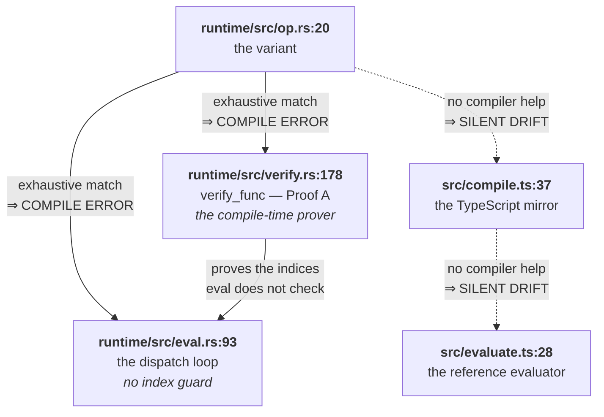
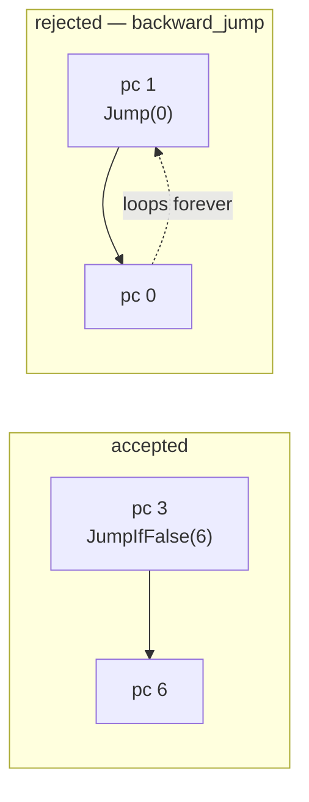

*ride Handbook · Part 4 of 9 — The bytecode*

# Instruction reference

**All 31 instructions, each with its stack effect and its two obligations.** This part is a
reference. Read §01 and §02 first, then use the tables.

[Index](README.md) · [1 Overview](01-overview.md) · [2 Language](02-language.md) ·
[3 Compiler](03-compiler.md) · **4 Bytecode** ·
[5 Verification](05-verification.md) · [6 Runtime](06-runtime.md) ·
[7 Testing](07-testing.md) · [8 Recipes](08-recipes.md) · [9 Roadmap](09-roadmap.md)

---

## Contents

- [01 · The shape of a program](#01--the-shape-of-a-program)
- [02 · The two obligations every instruction carries](#02--the-two-obligations-every-instruction-carries)
- [03 · Operands](#03--operands)
- [04 · Arithmetic](#04--arithmetic)
- [05 · The twelve builtins](#05--the-twelve-builtins)
- [06 · Comparison](#06--comparison)
- [07 · Control flow](#07--control-flow)
- [08 · The complete stack-effect table](#08--the-complete-stack-effect-table)
- [09 · The limits](#09--the-limits)

---

## 01 · The shape of a program

Three fields. `runtime/src/op.rs:111`

```rust
pub struct Program {
    pub code: Vec<Op>,        // one flat array, every function concatenated
    pub funcs: Vec<Func>,     // funcs[0] is the entry point
    pub state_arity: u8,      // field count of the STATE record
}

pub struct Func {             // runtime/src/op.rs:89
    pub entry: u32,           // index into `code` of the first instruction
    pub len: u32,             // instruction count, including the trailing Ret
    pub arity: u8,            // parameter count
    pub frame: u8,            // frame slots: parameters first, then locals
}
```

```
   code: one flat array. `funcs` carves it into windows.

   ┌──────────────── main ────────────────┬──────── double ────────┐
   │ 0    1    2                          │ 3    4    5    6       │
   │ Push Call Ret                        │ Load Push Mul  Ret     │
   └──────────────────────────────────────┴────────────────────────┘
     funcs[0] = { entry: 0, len: 3, … }     funcs[1] = { entry: 3, len: 4, … }
                                                      ↑
                                            a Call target is an ENTRY index,
                                            never an offset
```

Two conventions carry weight.

| Convention | Why | What breaks if ignored |
|------------|-----|------------------------|
| `funcs[0]` is the entry point | `runtime/src/eval.rs:91` starts at `p.funcs[0].entry` | The program runs the wrong function, silently |
| Every target is an **absolute index** into `code`, not an offset | One addressing mode, so `verify` needs no offset arithmetic | A target computed as an offset points into a different function |

---

## 02 · The two obligations every instruction carries

Adding an instruction is not a one-file change. Each variant owes its stack effect in **two**
places, and they must agree.



**Fig 1** The two Rust obligations are enforced by the compiler. The two TypeScript ones are not.
The dotted edges are where an instruction goes missing in practice.
`runtime/src/op.rs:20` · `runtime/src/verify.rs:178`

> ### The match arms are exhaustive on purpose
>
> `runtime/src/verify.rs:178` and `runtime/src/eval.rs:93` both match `Op` with **no `_`
> wildcard**.
>
> A wildcard would be shorter. It would also mean a new instruction compiles, verifies with the
> wrong stack effect, and evaluates as a no-op. The proof would then be wrong rather than absent,
> which is worse.
>
> So the missing wildcard is the mechanism. Add a variant to `runtime/src/op.rs` and `cargo
> build` fails in both files until both are answered. Keep it that way.
>
> `CLAUDE.md` §10 records this under Craft rules. Part 8 is the recipe that walks it.

### `Call` is the one to be careful with

Its stack effect is **pop `arity`, push 1**. `runtime/src/verify.rs:318`

That is correct **only because Proof B accounts for the callee's frame separately**. Proof A
treats a call as a single instruction and never looks inside the callee. Part 5 §03 holds the
other half.

Write that sentence next to any change to `Call`, or the two provers drift apart.

---

## 03 · Operands

| Instruction | Immediate | Stack effect | Reads | Line |
|-------------|-----------|--------------|-------|------|
| `Push(f32)` | the literal | +1 | — | `runtime/src/op.rs:23` |
| `LoadState(u8)` | field index | +1 | `state[i]` | `runtime/src/op.rs:25` |
| `LoadLocal(u8)` | frame slot | +1 | `frame[fp + i]` | `runtime/src/op.rs:27` |
| `StoreLocal(u8)` | frame slot | −1 | pops into `frame[fp + i]` | `runtime/src/op.rs:29` |

`LoadState` and `LoadLocal` both read an array the evaluator does not bounds-check. Proof A checks
the index against `state_arity` and against the function's `frame`.
`runtime/src/verify.rs:233` · `runtime/src/verify.rs:239`

---

## 04 · Arithmetic

Six instructions. All consume from the top of the stack.

| Instruction | Stack effect | Meaning | Line |
|-------------|--------------|---------|------|
| `Add` `Sub` `Mul` `Div` | −1 | the two operands, in postfix order | `runtime/src/op.rs:32-35` |
| `Pow` | −1 | `f32::powf`. The surface spells it `^`. | `runtime/src/op.rs:37` |
| `Neg` | 0 | rewrites the top in place | `runtime/src/op.rs:38` |

> ### `Div` by zero does not trap, and that is why the language has one number type
>
> `runtime/src/eval.rs:133` divides two `f32` values. Division by zero gives an infinity, and
> the program continues.
>
> That is an IEEE-754 property, not a check. There is no guard in the evaluator and none is
> needed.
>
> **Integer division is different.** In WebAssembly, `i32.div_s` *traps* on divide-by-zero and on
> `MIN / -1`. A trap is a panic on the evaluation path.
>
> So adding an `int` type would introduce a trap path into code that must not panic. Part 1 §07
> states the open decision and the three answers to it. This instruction is where the cost lands.

---

## 05 · The twelve builtins

| Instruction | Arity | Stack effect | Definition | Line |
|-------------|-------|--------------|------------|------|
| `Sin` `Cos` `Sqrt` `Abs` `Exp` | 1 | 0 | the named function | `runtime/src/op.rs:42-47` |
| `Sign` | 1 | 0 | `-1`, `0`, or `1`. **`Sign(0)` is `0`.** | `runtime/src/eval.rs:165` |
| `Max` `Min` | 2 | −1 | the larger or smaller | `runtime/src/op.rs:48-49` |
| `Step` | 2 | −1 | `step(edge, x)` = `0.0` when `x < edge`, else `1.0` | `runtime/src/eval.rs:186` |
| `Mix` | 3 | −2 | `mix(a, b, t)` = `(1 - t) * a + t * b` | `runtime/src/eval.rs:194` |
| `Clamp` | 3 | −2 | `clamp(x, lo, hi)` | `runtime/src/eval.rs:203` |
| `Select` | 4 | −3 | `select(edge, x, a, b)` = `a` when `x < edge`, else `b` | `runtime/src/eval.rs:211` |

### Argument order on the stack

Postfix pushes arguments left to right, so the **last** argument is on top. The evaluator reads
them in reverse.

```
   mix(a, b, t)   emits:  <a> <b> <t> Mix

   stack before Mix          stack after Mix
   ┌─────┐ top              ┌─────┐ top
   │  t  │                  │ res │
   ├─────┤                  └─────┘
   │  b  │                   res = (1-t)*a + t*b
   ├─────┤
   │  a  │
   └─────┘
```

`runtime/src/eval.rs:194` reads `t` at `top - 1`, `b` at `top - 2`, and `a` at `top - 3`. It reads
all three **before** it shrinks `top`, because shrinking first would make the later reads index
above the live region.

> ### `Step`, `Mix` and `Select` are branches written as arithmetic
>
> `mix(a, b, step(e, x))` gives `a` when `x < e` and `b` otherwise. That is an `if`.
>
> The difference is cost. The arithmetic form computes **every** arm on every call and then
> discards the arms it did not want. A real `if` evaluates one arm and jumps over the rest.
>
> These three instructions exist because the surface language offers the builtins. **Prefer `if`
> for a real choice.** Part 2 §05 says the same thing from the surface side.
>
> One case where the arithmetic form is better: an arm that is cheap and total. Three instructions
> with no jump can beat a compare plus two jumps.

---

## 06 · Comparison

| Instruction | Stack effect | Result | Line |
|-------------|--------------|--------|------|
| `Lt` `Gt` `Le` `Ge` `Eq` | −1 | `1.0` for true, `0.0` for false | `runtime/src/op.rs:62-66` |

A truth value is one `f32`. So the value representation needs no tag, and `if` costs no extra
machine word. `runtime/src/eval.rs:291` is the one-line helper that produces it.

`JumpIfFalse` tests against `0.0` exactly. `runtime/src/eval.rs:253`

---

## 07 · Control flow

| Instruction | Immediate | Stack effect | Line |
|-------------|-----------|--------------|------|
| `Jump(u32)` | absolute target | 0 | `runtime/src/op.rs:74` |
| `JumpIfFalse(u32)` | absolute target | −1 | `runtime/src/op.rs:76` |
| `Call { target, arity, fp_delta }` | three fields | −`arity`, +1 | `runtime/src/op.rs:81` |
| `Ret` | — | leaves exactly 1 | `runtime/src/op.rs:84` |

### Both jumps are forward only

`runtime/src/verify.rs:164` rejects a target that is not strictly greater than the jump's own
index.



**Fig 2** The language has no loop form and no recursion, so no legal program needs a backward
jump. Accepting one would let malformed bytecode spin forever inside one call, and the evaluator
has no iteration counter. `runtime/src/verify.rs:164` · `runtime/src/eval.rs:93`

### `Call` passes arguments through the frame

```
   main calls double(21)         main.frame = 0, double.frame = 1

   before Call                   after Call
   ─────────────────             ──────────────────────────────
   stack: [21.0]                 stack: []
   frame: [ … ]                  frame: [21.0]        ← copied from the stack
   fp = 0                        fp = 0 + fp_delta(0) = 0
   calls: []                     calls: [{ pc: 2, fp: 0 }]
   pc = 1                        pc = 3               ← double's entry
```

`runtime/src/eval.rs:258` does this in five steps: take the arguments off the operand stack, save
the return site, move `fp`, copy the arguments into the callee's window, and jump.

> ### The return stack saves two words, not one
>
> `runtime/src/eval.rs:262` stores a `Resume { pc, fp }`. A naive version would store only `pc`.
>
> Then `Ret` could restore where to continue but not **which frame window to continue in**. The
> caller would read the callee's locals, and the bug would appear only in a function that both
> calls something and has a local of its own.
>
> `runtime/src/eval.rs:274` restores both. The test
> `fpDelta is the caller frame size, so a caller with locals offsets the callee` in
> `test/compile.test.ts` is the one that would catch a regression here.

### `Ret` leaves its result on the operand stack

It does not move the value. The callee's single result is already where the caller's operand
would be, which is why `Call`'s net effect is "+1". `runtime/src/eval.rs:274`

When the return stack is empty, `Ret` ends the program and returns `stack[0]`.
`runtime/src/eval.rs:275`

---

## 08 · The complete stack-effect table

Every instruction, in one place. Use this when writing a prover arm or an evaluator arm.

| Group | Instructions | Needs on stack | Effect |
|-------|--------------|----------------|--------|
| push | `Push` `LoadState` `LoadLocal` | 0 | **+1** |
| store | `StoreLocal` | 1 | **−1** |
| binary | `Add` `Sub` `Mul` `Div` `Pow` `Max` `Min` `Step` `Lt` `Gt` `Le` `Ge` `Eq` | 2 | **−1** |
| unary | `Neg` `Sin` `Cos` `Sqrt` `Abs` `Sign` `Exp` | 1 | **0** |
| ternary | `Mix` `Clamp` | 3 | **−2** |
| quaternary | `Select` | 4 | **−3** |
| jump | `Jump` | 0 | **0**, then the path ends |
| branch | `JumpIfFalse` | 1 | **−1**, then the path continues |
| call | `Call` | `arity` | **−arity, +1** |
| return | `Ret` | exactly 1 | the path ends |

Counts: 4 operand, 6 arithmetic, 12 builtin, 5 comparison, 4 control flow. **31 total.**
`runtime/src/op.rs:20-84`

Proof A reads this table at `runtime/src/verify.rs:206-330`. The reference evaluator reads it at
`src/evaluate.ts:47-157`.

---

## 09 · The limits

Five ceilings. `verify` rejects a program that exceeds any one.

| Limit | Value | Checked | Cost if raised |
|-------|-------|---------|----------------|
| `MAX_CODE` | 4096 instructions | `runtime/src/verify.rs:116` | None at run time. Proof A allocates one `Vec<Option<i64>>` per function, so a larger cap costs verification memory. |
| `MAX_STACK` | 32 operands | `runtime/src/verify.rs:125` | 4 bytes per slot on the evaluator's own stack frame. Raising it is nearly free. |
| `MAX_FRAME` | 64 slots | `runtime/src/verify.rs:131` | 4 bytes per slot. Part 9 lists slot reuse as the alternative to raising it. |
| `MAX_CALLS` | 16 frames | `runtime/src/verify.rs:134` | 8 bytes per entry. The deepest observed program needs 2. |
| `MAX_FUNCS` | 256 functions | `runtime/src/verify.rs:113` | Bounds the verifier's own recursion over the call graph. See Part 5 §03. |

All five are `pub const` in `runtime/src/verify.rs:29-37`. The evaluator sizes its three arrays
from `MAX_STACK`, `MAX_FRAME` and `MAX_CALLS` directly, so a change to one changes the
evaluator's stack footprint. `runtime/src/eval.rs:84-86`

> ### The limits are ceilings, and `Bounds` is the real cost
>
> A program that passes verification carries a `Bounds` record with what it **actually** needs.
> `runtime/src/verify.rs:97`
>
> `Verified::bounds()` returns it. `runtime/src/eval.rs:65`
>
> So a host can report the real stack depth of a program rather than the ceiling. A four-arm
> piecewise function needs a stack of 3, not 32. The test
> `bounds_report_the_program_not_the_ceiling` in `runtime/tests/runtime.rs` pins the distinction.

---

> Sources read for this part: `runtime/src/op.rs` in full, `runtime/src/verify.rs` lines 29–37,
> 97–145, 151–175 and 206–340, `runtime/src/eval.rs` in full, `src/evaluate.ts` lines 28–160,
> and `runtime/tests/runtime.rs`. The 31 count in §08 was taken by counting the variants in
> `runtime/src/op.rs:20-84`, not from a comment. Stack effects were read from the prover arms,
> and each one was cross-checked against the matching evaluator arm. Line references point at the
> source as read on **2026-10-03**. **Names and rules are stable. Line numbers move.**
