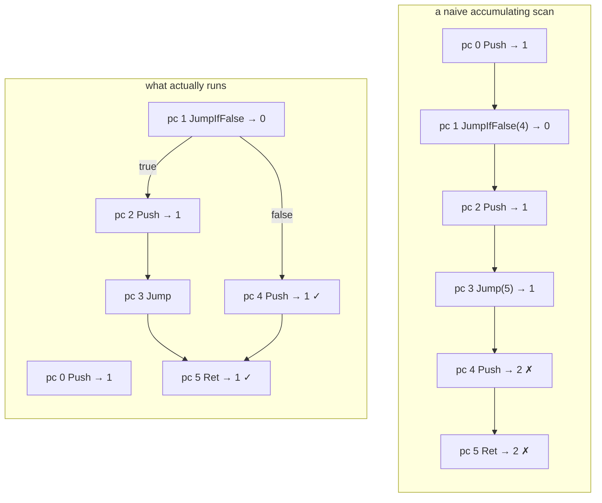
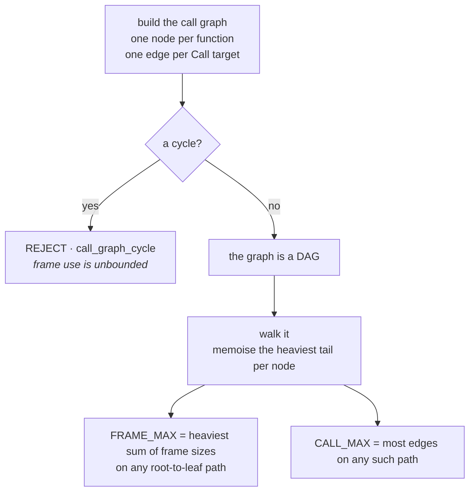
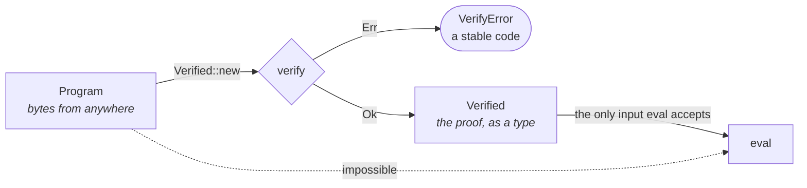

*ride Handbook · Part 5 of 9 — Verification*

# The verify band

**The trust boundary.** This part runs once per program load, and it is the only band that assumes
its input is hostile. Nothing is evaluated until both proofs pass.

[Index](README.md) · [1 Overview](01-overview.md) · [2 Language](02-language.md) ·
[3 Compiler](03-compiler.md) · [4 Bytecode](04-bytecode.md) ·
**5 Verification** · [6 Runtime](06-runtime.md) ·
[7 Testing](07-testing.md) · [8 Recipes](08-recipes.md) · [9 Roadmap](09-roadmap.md)

---

## Contents

- [01 · Why the proofs exist](#01--why-the-proofs-exist)
- [02 · Proof A — the operand stack](#02--proof-a--the-operand-stack)
- [03 · Proof B — frames and call depth](#03--proof-b--frames-and-call-depth)
- [04 · Forward-only jumps](#04--forward-only-jumps)
- [05 · The twenty errors](#05--the-twenty-errors)
- [06 · The Verified type](#06--the-verified-type)

---

## 01 · Why the proofs exist

The evaluator indexes three arrays and **checks no index**.

```rust
// runtime/src/eval.rs:106
Op::LoadLocal(i) => {
    stack[top] = frame[fp + i as usize];   // no bounds check
    top += 1;
    pc += 1;
}
```

That is not an oversight. A per-instruction bounds check in the evaluation path would cost on
every call, and the cost would buy nothing that a one-time proof does not already give.

So the proofs are the guard. `runtime/src/verify.rs:108`

| What the evaluator assumes | Which proof gives it |
|----------------------------|----------------------|
| `top` stays inside `[0, MAX_STACK)` | Proof A |
| `fp + i` stays inside `[0, MAX_FRAME)` | Proof B for `fp`, Proof A for `i` |
| `rp` stays inside `[0, MAX_CALLS)` | Proof B |
| `state[i]` is in range | Proof A checks `i < state_arity`; `Verified::eval` checks the record length |
| The loop ends | Forward-only jumps, plus an acyclic call graph |
| `stack[0]` holds the result at the end | Proof A requires exactly one live value at every `Ret` |

---

## 02 · Proof A — the operand stack

`verify_func` runs once per function and returns the deepest operand stack any path reaches.
`runtime/src/verify.rs:178`

### The failure a naive scan has

A single accumulating pass over the instruction array is sound only for straight-line code. It
assumes the next instruction always runs after this one.



**Fig 1** The naive scan adds the `else` arm's push on top of the `then` arm's result, because it
never notices the `Jump` at index 3. Its height at the `Ret` is 2. The real height is 1 on both
paths. `runtime/src/verify.rs:178`

A wrong height is worse than no height. It would size the evaluator's stack from a number that
describes no execution.

### The rule that replaces it

Keep a height table. Write at each jump. **Check on arrival.**
`runtime/src/verify.rs:151`

```
   expected: Vec<Option<i64>>        one slot per instruction in this function
   expected[0] = Some(0)             a function is entered with an empty stack

   at a Jump(t) or JumpIfFalse(t):
       write the current height into expected[t]
       if expected[t] already holds a DIFFERENT height  →  height_mismatch

   on arrival at index i:
       if expected[i] is Some(e):
           carrying a height, and it differs from e      →  height_mismatch
           carrying nothing (a path just ended)          →  adopt e

   after an unconditional Jump:  height = None   (this path ends)
   at a Ret:                     height must be exactly 1
```

This is the rule a WebAssembly validator applies at a block boundary. Here it works on a flat
instruction array rather than on nested blocks, which is why the table is indexed by instruction
and not by block depth.

### Worked example

The four-arm program from `runtime/tests/runtime.rs` (`four_arm_piecewise_function`):

```
   idx  instruction        height after    the table
   ───  ────────────────   ────────────    ─────────────────────────────
     3  JumpIfFalse(6)          0          expected[6]  ← 0
     5  Jump(36)                1          expected[36] ← 1
     9  JumpIfFalse(16)         0          expected[16] ← 0
    15  Jump(36)                1          expected[36] = 1   ✓ agrees
    19  JumpIfFalse(31)         0          expected[31] ← 0
    30  Jump(36)                1          expected[36] = 1   ✓ agrees
    35  Sub                     1          falls through
    36  Ret                     1          ✓ matches expected[36]
```

**Index 36 is written three times, and every write is 1.** A fourth path falls through to it, also
at 1. That is four paths agreeing, and it is Proof A doing real work rather than restating the
obvious.

The measured stack bound for that program is **3**. The test asserts it.

### What Proof A also checks

Three index checks ride along in the same pass, because the pass already visits every
instruction.

| Check | Line | Rejects |
|-------|------|---------|
| `LoadState(i)` needs `i < state_arity` | `runtime/src/verify.rs:233` | a read past the STATE record |
| `LoadLocal(i)` / `StoreLocal(i)` need `i < frame` | `runtime/src/verify.rs:239` | a read or write past the frame window |
| every pop needs enough live operands | `runtime/src/verify.rs:224` | an underflow, which would index below the stack |

> ### Why unreachable code is an error and not a warning
>
> `runtime/src/verify.rs:217` returns `Unreachable` when it reaches an instruction while carrying
> no height and finds no recorded height for it.
>
> A compiler that emitted dead code would be rejected. That seems strict.
>
> It is the right strictness here for one reason: **a height the prover cannot derive is a height
> it cannot bound.** The alternative is to skip the instruction, and then a later jump into that
> region would arrive with no recorded expectation and pass unchecked.
>
> `src/compile.ts` never emits dead code, so no legal program hits this. The test
> `rejects_unreachable_code` in `runtime/tests/runtime.rs` pins it.

---

## 03 · Proof B — frames and call depth

Proof A bounds one function. It says nothing about how many frames are live at once.
`runtime/src/verify.rs:344`

### The premise

**The language forbids recursion.** Part 2 §06 says the grammar cannot state that, and Part 3 §03
says the compiler checks it by name. Proof B is where it becomes a machine-checked fact about
bytecode.



**Fig 2** A cycle is rejected before any bound is computed, because a cyclic graph has no longest
path. The rejection is what turns "no recursion" from a convention into a premise the evaluator
can rely on. `runtime/src/verify.rs:344` · `runtime/src/verify.rs:380`

### How the walk works

`walk` is a depth-first search with three colours. `runtime/src/verify.rs:380`

| Colour | Meaning | Action on arrival |
|--------|---------|-------------------|
| 0 unvisited | not seen | descend |
| 1 on the current path | **a cycle** | return `CallGraphCycle` |
| 2 finished | already measured | return the memoised result |

The memo holds a pair per function: the heaviest frame sum below it, and the deepest call nesting
below it. One pass, `O(nodes + edges)`.

### A worked bound

```
   let double a = a * 2          frame 1  (one parameter)
   let main = double(21)         frame 0  (no parameters, no locals)

   call graph:  main ──→ double

   walk(double) = (1 + 0, 0)   =  (1, 0)      a leaf
   walk(main)   = (0 + 1, 0+1) =  (1, 1)

   Bounds { stack: …, frame: 1, calls: 1 }
```

The test `direct_call_passes_arguments_through_the_frame` in `runtime/tests/runtime.rs` asserts
`frame == 1` and `calls == 1` exactly.

> ### The verifier recurses, and that is bounded on purpose
>
> `walk` calls itself. A deeply chained call graph would therefore recurse deeply in the
> **verifier**, which is Rust code with a real stack.
>
> `MAX_FUNCS` is 256 and is checked first, at `runtime/src/verify.rs:113`. So the recursion depth
> is bounded by 256 before `walk` ever runs.
>
> That is why the function-count limit exists. It is not about program size. It is about the
> verifier's own stack.

### Why `frame` and `calls` take a maximum over every node

`runtime/src/verify.rs:368` loops over **all** functions and takes the maximum, not just the
entry point's value.

Evaluation always starts at `funcs[0]`, so the entry point's number is the one that matters. The
maximum over all nodes is greater than or equal to it.

That over-approximates. It is also simpler, and a safe over-approximation of a bound is still a
bound. A future entry point other than `funcs[0]` would need no change.

---

## 04 · Forward-only jumps

`record` rejects a target that is not strictly ahead. `runtime/src/verify.rs:164`

```rust
if t < lo || t >= hi {
    return Err(VerifyError::BadJumpTarget);   // outside this function
}
if t <= pc {
    return Err(VerifyError::BackwardJump);    // not strictly ahead
}
```

Two separate reasons, and both are load-bearing.

**1 · Termination.** The evaluator has no iteration counter. `runtime/src/eval.rs:93` loops until
a `Ret` with an empty return stack. A backward jump in malformed bytecode would spin forever, and
the host would hang with no error.

**2 · Proof A's soundness.** The height table is filled by a single forward pass. A backward jump
would write `expected[t]` for an index the pass has **already left**, so the check on arrival
would never run.

So the restriction is not a simplification. Remove it and both the proof and the termination
guarantee fail together.

> ### The compiler cannot emit a backward jump, and the runtime still checks
>
> `src/compile.ts:321` patches every jump target to `code.length` at a point after the
> placeholder. A target is therefore always greater than its own index, by construction.
>
> The runtime checks anyway. Part 1 §02 gives the reason in one line: bytecode can arrive without
> passing through the compiler.
>
> The cost of the check is one integer comparison per jump, once per program load. The cost of
> omitting it is a hung page.

---

## 05 · The twenty errors

Every rejection, with the rule it enforces. `runtime/src/verify.rs:44`

Each variant has a stable string `code()`. Errors leave the runtime as codes, never as a panic
and never as a formatted message, so a host can branch on one without parsing prose.
`runtime/src/verify.rs:67`

| Code | Rule it enforces | What it rejects |
|------|------------------|-----------------|
| `no_functions` | A program has an entry point | An empty function table |
| `too_many_functions` | `MAX_FUNCS` = 256 | A graph too deep for the verifier's own recursion |
| `code_too_long` | `MAX_CODE` = 4096 | A program whose height table would be oversized |
| `func_out_of_range` | A function's window lies inside `code` | An `entry` or `len` pointing past the array |
| `missing_ret` | A function ends with `Ret` | A function that would run into the next one |
| `bad_state_index` | `LoadState(i)` has `i < state_arity` | A read past the STATE record |
| `bad_local_index` | A slot is inside the frame window | A read or write past the window; also `arity > frame` |
| `bad_jump_target` | A target lies inside the same function | A jump into another function's body |
| `backward_jump` | A target is strictly ahead | A loop. See §04. |
| `height_mismatch` | Every path to a point agrees on the stack height | Two arms leaving different heights |
| `unreachable` | Every instruction is reachable | Dead code, whose height cannot be derived |
| `stack_underflow` | A pop has operands to take | An operation with too few operands |
| `stack_overflow` | `MAX_STACK` = 32 | A program needing a deeper operand stack |
| `not_one_result` | A `Ret` finds exactly one value | A function returning nothing or two values |
| `bad_call_target` | A `Call` target is a declared entry | A call into the middle of a function |
| `arity_mismatch` | A call site matches the callee's arity | A call passing the wrong number of arguments |
| `frame_delta_mismatch` | `fp_delta` equals the caller's frame size | A `Call` that would overlap two frame windows |
| `call_graph_cycle` | The call graph is acyclic | Recursion, direct or mutual |
| `frame_overflow` | `MAX_FRAME` = 64 | A call path needing more frame slots |
| `call_depth_overflow` | `MAX_CALLS` = 16 | A call path deeper than the return stack |

A test asserts the twenty codes do not collide: `every_error_has_a_distinct_code` in
`runtime/tests/runtime.rs`. Two errors sharing a code would be indistinguishable to a host.

---

## 06 · The Verified type

`Verified` wraps a `Program` with its `Bounds`. `runtime/src/eval.rs:51`

```rust
pub struct Verified {
    program: Program,     // private
    bounds: Bounds,       // private
}

impl Verified {
    pub fn new(program: Program) -> Result<Self, VerifyError> {   // eval.rs:58
        let bounds = verify(&program)?;
        Ok(Verified { program, bounds })
    }
}
```

Both fields are private, and `new` is the only constructor. So **a `Verified` cannot exist unless
both proofs passed.**



**Fig 3** The dotted edge does not exist in the type system. `eval` is a method on `Verified`, so
a raw `Program` has no way to reach the evaluator. `runtime/src/eval.rs:51` · `runtime/src/eval.rs:74`

This is the whole reason `Verified` is a separate type from `Program`. Holding one is the proof.

`bounds()` returns what the program **actually** needs, not the ceiling.
`runtime/src/eval.rs:65`

---

> Sources read for this part: `runtime/src/verify.rs` in full, `runtime/src/eval.rs` lines 51–82
> and 93–115, and `runtime/tests/runtime.rs` in full. The worked height table in §02 and the
> worked bound in §03 are the programs asserted in `runtime/tests/runtime.rs`
> (`four_arm_piecewise_function` and `direct_call_passes_arguments_through_the_frame`), not hand
> traces. Line references point at the source as read on **2026-10-03**.
> **Names and rules are stable. Line numbers move.**
