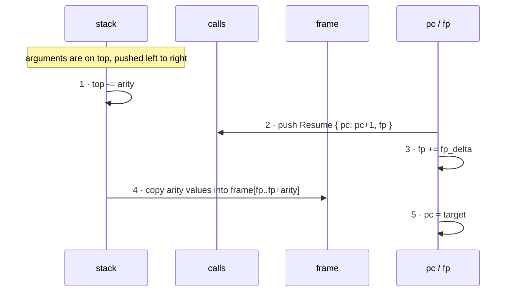

*ride Handbook · Part 6 of 9 — The runtime*

# The evaluate band

**Everything that happens on every call. No memory is allocated.** This part is the dispatch loop.
It is the only code that runs more than once per program.

[Index](README.md) · [1 Overview](01-overview.md) · [2 Language](02-language.md) ·
[3 Compiler](03-compiler.md) · [4 Bytecode](04-bytecode.md) ·
[5 Verification](05-verification.md) · **6 Runtime** ·
[7 Testing](07-testing.md) · [8 Recipes](08-recipes.md) · [9 Roadmap](09-roadmap.md)

---

## Contents

- [01 · The loop](#01--the-loop)
- [02 · The three arrays and the three pointers](#02--the-three-arrays-and-the-three-pointers)
- [03 · Why a program counter and not an iterator](#03--why-a-program-counter-and-not-an-iterator)
- [04 · A call, step by step](#04--a-call-step-by-step)
- [05 · A traced frame](#05--a-traced-frame)
- [06 · The four guarantees](#06--the-four-guarantees)
- [07 · The one runtime error](#07--the-one-runtime-error)
- [08 · The reference evaluator in TypeScript](#08--the-reference-evaluator-in-typescript)

---

## 01 · The loop

`run` is one `while`-shaped loop over a program counter. `runtime/src/eval.rs:83`

```rust
fn run(p: &Program, state: &[f32]) -> f32 {
    let mut stack = [0.0f32; MAX_STACK];              // eval.rs:84
    let mut frame = [0.0f32; MAX_FRAME];              // eval.rs:85
    let mut calls = [Resume { pc: 0, fp: 0 }; MAX_CALLS];  // eval.rs:86

    let mut top = 0usize;   // live operand count          eval.rs:88
    let mut fp  = 0usize;   // base of the frame window     eval.rs:89
    let mut rp  = 0usize;   // live return-stack entries     eval.rs:90
    let mut pc  = p.funcs[0].entry as usize;                // eval.rs:91

    loop {
        match p.code[pc] { … }    // 31 arms, no wildcard   eval.rs:93
    }
}
```

Every arm does two things: it changes the operand stack, and it moves `pc`. The arithmetic arms
add 1 to `pc`. The control-flow arms assign it.

---

## 02 · The three arrays and the three pointers

```
   stack: [f32; 32]        operands                 bounded by Proof A
   ┌────┬────┬────┬────┬───
   │    │    │    │    │ …          top ──→ one past the live region
   └────┴────┴────┴────┴───              the top VALUE is stack[top - 1]

   frame: [f32; 64]        params + locals          bounded by Proof B
   ┌─────────────┬─────────────┬───
   │ main's win  │ callee's win│ …      fp ──→ base of the RUNNING window
   └─────────────┴─────────────┴───           a local is frame[fp + slot]
     ↑ fp = 0      ↑ fp = 0 + fp_delta

   calls: [Resume; 16]     return sites            bounded by Proof B
   ┌──────────────┬───
   │ { pc, fp }   │ …              rp ──→ one past the live region
   └──────────────┴───
```

All three are **stack-allocated inside `run`**, sized from the `pub const` ceilings in
`runtime/src/verify.rs:29-37`. Total footprint: 32×4 + 64×4 + 16×8 = **512 bytes**.

| Array | Size | Why this array and not a `Vec` |
|-------|------|--------------------------------|
| `stack` | 128 B | A `Vec` would allocate on first push. Proof A already bounds the depth, so a fixed array needs no growth path. |
| `frame` | 256 B | The same argument. Proof B bounds it. |
| `calls` | 128 B | Holds two words per entry. See §04 for why both are needed. |

> ### The arrays are sized from the ceiling, not from the program
>
> `run` allocates `MAX_STACK` slots even for a program that needs 3.
>
> That wastes stack space. The alternative is to size from `Bounds`, which would need a `Vec` or a
> const generic, and a `Vec` allocates.
>
> 512 bytes on a call stack is cheaper than one heap allocation, so the ceiling wins. A host that
> wants the real numbers reads `Verified::bounds()`, which reports what the program actually
> needs. `runtime/src/eval.rs:65`

---

## 03 · Why a program counter and not an iterator

This is the one change that the branch instructions require.

```rust
// What a flat expression evaluator looks like — no branches, so an iterator works:
for instr in &program.instrs {
    match *instr { … }
}

// What ride needs — `pc` is assignable, so a jump is possible:
let mut pc = p.funcs[0].entry as usize;
loop {
    match p.code[pc] {
        Op::Jump(t)        => { pc = t as usize; }                     // eval.rs:250
        Op::JumpIfFalse(t) => { top -= 1;
                                pc = if stack[top] == 0.0 { t as usize }
                                     else { pc + 1 }; }                // eval.rs:253
        …
    }
}
```

**An iterator cannot jump.** `for instr in slice` yields each element once, in order. There is no
way to redirect it to index 36. So the loop shape is not a style choice — it follows directly from
having `Jump` in the instruction set.

The cost is that every arm must now advance `pc` itself. A missing `pc += 1` is an infinite loop
on that instruction, and the compiler gives no warning. That is the price of the assignable
counter.

---

## 04 · A call, step by step

`Op::Call` does five things in order. `runtime/src/eval.rs:258`



**Fig 1** The order matters. Step 1 must come before step 4, because step 4 copies from the region
step 1 just released. And step 3 must come before step 4, because step 4 writes at the new `fp`.
`runtime/src/eval.rs:258-272`

`Op::Ret` undoes it. `runtime/src/eval.rs:274`

```
   rp == 0   →  the entry function has returned. Return stack[0].    eval.rs:275
   rp  > 0   →  rp -= 1
                pc = calls[rp].pc
                fp = calls[rp].fp
```

**`Ret` does not move the result.** The callee's single value is already at the top of the operand
stack, which is exactly where the caller's operand belongs. That is why `Call`'s net stack effect
is "pop `arity`, push 1" and why Proof A can treat a call as one instruction.

> ### The return stack saves two words, and one would be a real bug
>
> `runtime/src/eval.rs:262` stores a `Resume { pc, fp }`.
>
> A version that saved only `pc` would compile and pass most tests. `Ret` would restore where to
> continue, but not **which frame window to continue in**. The caller would then read the callee's
> locals.
>
> The bug would appear only in a function that both calls something **and** has a local of its
> own, because `fp_delta` is zero otherwise and the stale `fp` would happen to be right.
>
> The test that would catch it is
> `fpDelta is the caller frame size, so a caller with locals offsets the callee` in
> `test/compile.test.ts`. It compiles `let main = let k = 5 in twice(k)`, where the caller's frame
> is 1.

---

## 05 · A traced frame

One call of `let main = if s < 10 then 1 else 2`, with `s = 30`. The bytecode is the one Part 3
§08 asserts.

| pc | instruction | stack after | top | what happened |
|----|-------------|-------------|-----|---------------|
| 0 | `LoadState(0)` | `[30.0]` | 1 | read `s` from the record |
| 1 | `Push(10)` | `[30.0, 10.0]` | 2 | — |
| 2 | `Lt` | `[0.0]` | 1 | 30 < 10 is false, so `0.0` |
| 3 | `JumpIfFalse(6)` | `[]` | 0 | pops the test; it is false, so `pc` becomes 6 |
| 6 | `Push(2)` | `[2.0]` | 1 | the `else` arm |
| 7 | `Ret` | `[2.0]` | 1 | `rp` is 0, so return `stack[0]` = **2.0** |

Five instructions ran. Indices 4 and 5 — the `then` arm and its `Jump` — were never reached.

That is the difference between a real branch and the arithmetic form in Part 4 §05. A
`mix`/`step` encoding would have computed both arms and discarded one.

---

## 06 · The four guarantees

| Guarantee | Why it holds | What would break it |
|-----------|--------------|---------------------|
| **No allocation** | Three fixed arrays, stack-allocated. A call copies `arity` floats and writes two words. | Any `Vec`, `Box`, or `String` in the loop. |
| **No panic** | Proof A bounds `top`. Proof B bounds `fp` and `rp`. So every index is in range by construction, and `run` returns `f32` rather than `Result`. | A new instruction whose prover arm disagrees with its evaluator arm. |
| **The loop ends** | Jumps are forward-only, and the call graph is acyclic. `pc` cannot return to an index it already left inside one call. | Accepting a backward jump. There is no iteration counter to fall back on. |
| **One pass, `O(instructions)`** | Each instruction costs one array index, one match arm, and one `pc` write. | Nothing in the current design. |

`#![forbid(unsafe_code)]` at `runtime/src/lib.rs:42` keeps the first two honest. A bounds failure
would be a Rust panic, not memory corruption — so a wrong proof is loud, not silent.

> ### `run` returns `f32`, not `Result`, and that is a claim
>
> Most evaluators return a result type. This one does not.
>
> The signature is the claim: **every fault was already rejected.** A `Result` here would invite a
> caller to handle an error that cannot occur, and it would hide which layer owns the guarantee.
>
> The one fault that **can** occur at call time is handled one level up, in §07, because it is a
> property of the call and not of the program.

---

## 07 · The one runtime error

`Verified::eval` checks the STATE record length, then calls `run`.
`runtime/src/eval.rs:74`

```rust
pub fn eval(&self, state: &[f32]) -> Result<f32, EvalError> {
    if state.len() < self.program.state_arity as usize {
        return Err(EvalError::StateTooShort);
    }
    Ok(run(&self.program, state))
}
```

`EvalError` has exactly one variant. `runtime/src/eval.rs:34`

| Code | When | Why it cannot be proven away |
|------|------|------------------------------|
| `state_too_short` | The caller passed fewer fields than the program declares | The record arrives at **call** time. `verify` sees the program, not the call. |

Proof A already checked that every `LoadState(i)` has `i < state_arity`. So one length check at
the top of `eval` covers every read in the whole program, and `run` needs no per-read guard.

---

## 08 · The reference evaluator in TypeScript

A second evaluator exists at `src/evaluate.ts:28`. It is not the shipped path.

| | Rust, `runtime/src/eval.rs` | TypeScript, `src/evaluate.ts` |
|---|---|---|
| Role | ships | reference, for tests and differential checking |
| Arrays | fixed, 512 bytes | `number[]`, grows |
| Termination | proven: forward jumps + acyclic graph | guarded: a step limit of 1 000 000 at `src/evaluate.ts:45` |
| Precision | `f32` natively | `f64`, rounded through `Math.fround` at `src/evaluate.ts:18` |

The TypeScript side exists so the front end can be tested without a Rust toolchain. Part 7 §03
describes the harness that keeps the two together.

> ### The two evaluators are bit-exact except for five instructions
>
> `src/evaluate.ts:18` rounds every arithmetic result with `Math.fround`, so `Add`, `Sub`, `Mul`,
> `Div`, the comparisons, the branches and the calls all agree **bit for bit** with the Rust
> runtime.
>
> `Sin`, `Cos`, `Sqrt`, `Exp` and `Pow` do not. `Math.cos` computes in `f64` and is then rounded
> to `f32`. Rust's `f32::cos` computes in `f32` throughout. The two can differ in the last bit.
>
> **This is why the differential harness uses a relative tolerance and not equality.** The reason
> is written at the top of the generated test file. Do not tighten it: a real fault — a wrong
> branch, a wrong frame slot, a mispatched jump — moves the result by orders of magnitude, not by
> one bit.

---

> Sources read for this part: `runtime/src/eval.rs` in full, `runtime/src/verify.rs` lines 29–37,
> `runtime/src/lib.rs`, `src/evaluate.ts` lines 18–50, and `test/compile.test.ts`. The traced
> frame in §05 was derived from the bytecode that `test/compile.test.ts` asserts, and each step
> was read from the matching arm in `runtime/src/eval.rs`. The 512-byte figure is
> `MAX_STACK`×4 + `MAX_FRAME`×4 + `MAX_CALLS`×8 using the constants as read. Line references point
> at the source as read on **2026-10-03**.
> **Names and rules are stable. Line numbers move.**
