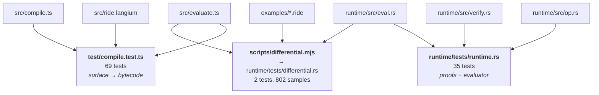
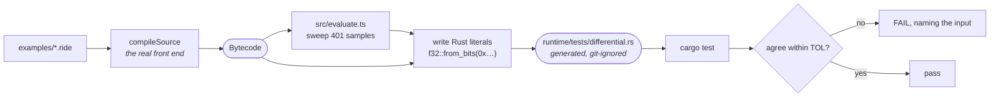

*ride Handbook · Part 7 of 9 — Testing*

# The gate

**How the project proves itself, and what each suite actually protects.** Run the gate before you
present any change.

[Index](README.md) · [1 Overview](01-overview.md) · [2 Language](02-language.md) ·
[3 Compiler](03-compiler.md) · [4 Bytecode](04-bytecode.md) ·
[5 Verification](05-verification.md) · [6 Runtime](06-runtime.md) ·
**7 Testing** · [8 Recipes](08-recipes.md) · [9 Roadmap](09-roadmap.md)

---

## Contents

- [01 · The commands](#01--the-commands)
- [02 · What each suite protects](#02--what-each-suite-protects)
- [03 · The differential harness](#03--the-differential-harness)
- [04 · The hostile-program suite](#04--the-hostile-program-suite)
- [05 · What the harness does not catch](#05--what-the-harness-does-not-catch)

---

## 01 · The commands

```bash
npm install
npm run langium:generate     # REQUIRED after any edit to src/ride.langium
npm run check                # the gate: both suites
```

| Command | Runs | Needs the network | Defined in |
|---------|------|-------------------|------------|
| `npm test` | 69 front-end tests, vitest | no, after install | `package.json:22` |
| `npm run test:runtime` | 35 runtime + 2 differential + 1 doctest, cargo | **no, ever** | `package.json:25` |
| `npm run check` | both of the above | no, after install | `package.json:26` |
| `npx tsc --noEmit` | typecheck | no | — |
| `npm run langium:generate` | regenerate the parser and AST | no | `package.json:18` |
| `npm run build:wasm` | compile the runtime to wasm | no | `package.json:25` |

**Current state, measured on 2026-10-04:** 69 + 35 + 2 + 1 = **107 tests, all passing.**

The runtime half runs against an empty dependency graph, so `cargo test` works with no npm and no
network. `runtime/Cargo.toml:12`

> ### Regenerate after every grammar edit, or the tests lie
>
> `src/generated/**` holds the parser and the AST types. It is **committed**, and it is written by
> `npm run langium:generate`.
>
> Edit `src/ride.langium` without that command and every test still passes — against the **old**
> grammar. The grammar file is then no longer the source of truth, and the failure appears later,
> in a place that has nothing to do with the edit.
>
> `CLAUDE.md` §10 states the rule. `npm run build` runs the codegen first, at `package.json:20`,
> so building is safe. Running `npm test` alone is not.

---

## 02 · What each suite protects



**Fig 1** The differential harness is the only test that reads both evaluators. It is what protects
the drift risk in Part 1 §05 row 3. `scripts/differential.mjs:1` · `src/evaluate.ts:28`

| Suite | Tests | Protects |
|-------|-------|----------|
| `test/compile.test.ts` | 69 | The surface language, the exact bytecode for small programs, every diagnostic message, and the first-order and no-recursion rules |
| `runtime/tests/runtime.rs` | 35 | Both proofs, every evaluator arm, the 20 error codes, and seventeen rejections of malformed bytecode |
| `runtime/tests/differential.rs` | 2 | That the two evaluators agree over 802 sampled inputs |
| the doctest in `runtime/src/lib.rs` | 1 | That the example in the crate documentation compiles and gives the stated answer |

Nine front-end tests assert the **exact instruction list**, not just the result. One is in Part 3
§08. Those are the tests that catch an emitter change nobody intended.

---

## 03 · The differential harness

There are two implementations of one instruction set. Two implementations of anything drift.



**Fig 2** The harness writes the expected values as exact `f32` bit patterns, so no decimal
round-trip can lose a bit between the two languages.
`scripts/differential.mjs:27` · `scripts/differential.mjs:19`

```bash
npm run build && node scripts/differential.mjs && npm run test:runtime
```

| Setting | Value | Where | Effect if changed |
|---------|-------|-------|-------------------|
| samples per example | 401 | `scripts/differential.mjs:19` | Fewer samples means a narrow breakpoint can be stepped over |
| the swept range | per example | `scripts/differential.mjs:22` | A range that misses a breakpoint leaves one arm untested |
| tolerance | `1e-5` relative | the generated file header | Tightening it to equality makes the transcendental arms fail. See Part 6 §08. |

The generated file is **git-ignored**. `.gitignore` lists it, because it is derived from
`examples/` and the two evaluators. Regenerate it; do not commit it.

### A failure names the input

An inverted `JumpIfFalse` in the Rust evaluator produces this:

```
ramp.ride: at state 0 the runtime gave -161.181, the reference gave 350.1
```

That message is the harness earning its place. It names the example, the input, and both answers.

---

## 04 · The hostile-program suite

Seventeen tests in `runtime/tests/runtime.rs` feed `verify` bytecode that no compiler would produce.
This is the suite that protects the evaluator's unchecked indexing.

| Test | Hand-built fault | Expected code |
|------|------------------|---------------|
| `rejects_a_backward_jump` | `Jump(0)` at index 1 | `backward_jump` |
| `rejects_a_jump_out_of_its_own_function` | `Jump(4)` into the next function's code | `bad_jump_target` |
| `rejects_two_jumps_that_disagree_at_one_target` | two jumps record heights 0 and 2 at one index | `height_mismatch` |
| `rejects_arms_that_leave_different_heights` | one arm pushes two values, the other pushes one | `height_mismatch` |
| `rejects_a_call_graph_cycle` | `f` calls `g`, `g` calls `f` | `call_graph_cycle` |
| `rejects_self_recursion` | `f` calls `f` | `call_graph_cycle` |
| `rejects_reading_past_the_state_record` | `LoadState(3)` with `state_arity` 2 | `bad_state_index` |
| `rejects_reading_past_the_frame_window` | `LoadLocal(2)` with `frame` 1 | `bad_local_index` |
| `rejects_a_stack_underflow` | `Add` with an empty stack | `stack_underflow` |
| `rejects_a_stack_overflow` | 33 values live at once, one past the ceiling | `stack_overflow` |
| `rejects_a_function_that_does_not_leave_exactly_one_value` | two pushes, then `Ret` | `not_one_result` |
| `rejects_a_missing_ret` | a function with no `Ret` | `missing_ret` |
| `rejects_a_call_to_a_non_entry_point` | `Call { target: 99 }` | `bad_call_target` |
| `rejects_an_arity_mismatch` | callee declares 2, call site passes 1 | `arity_mismatch` |
| `rejects_a_call_whose_frame_delta_is_not_the_caller_frame` | `fp_delta` 1 from a caller with frame 0 | `frame_delta_mismatch` |
| `rejects_unreachable_code` | a `Jump` over a live instruction | `unreachable` |
| `rejects_an_empty_program` | no functions | `no_functions` |

Each test asserts the **exact** error, not merely that an error occurred. A test that accepted any
rejection would pass while the verifier rejected for the wrong reason.

An eighteenth test, `rejects_a_state_record_that_is_too_short`, belongs to a different layer. It
checks `EvalError`, not `VerifyError`, because a short STATE record is a property of the **call**
and not of the program. Part 6 §07 holds that one.

`every_error_has_a_distinct_code` checks the 20 codes do not collide. Two errors sharing a code
would be indistinguishable to a host.

> ### Write the hostile test by hand, not through the compiler
>
> Every test above builds a `Program` literal. None of them compiles source.
>
> That is necessary, not lazy. `src/compile.ts` **cannot** emit a backward jump or a mismatched
> arm height — Part 5 §04 explains why. So a test that went through the compiler could not
> construct the fault at all.
>
> The proofs exist for bytecode that did not come from this compiler. The tests have to arrive the
> same way.

---

## 05 · What the harness does not catch

The differential harness covers only what the examples exercise. That limit was found by mutation
testing, not by reading.

| Mutation applied | Caught by | Not caught by |
|------------------|-----------|---------------|
| `JumpIfFalse` condition inverted in `runtime/src/eval.rs:253` | the differential tests, with the input named | — |
| `step` boundary changed from `x < edge` to `x <= edge` in `runtime/src/eval.rs:186` | `step_and_mix_keep_their_published_meaning` and `a_branchless_blend_and_a_branch_agree_bit_for_bit`, both in `runtime/tests/runtime.rs` | **the differential tests** |

> ### The differential harness does not test `step`, because no example uses it
>
> Changing the `step` boundary in `runtime/src/eval.rs:186` left both differential tests passing.
>
> The reason is simple. `examples/ramp.ride` and `examples/projectile.ride` use `cos`, `sqrt`,
> `clamp` and arithmetic. Neither calls `step`. So the harness had nothing to compare.
>
> The unit tests did catch it. The protection was real, and it came from a test that pins the
> **published meaning** of the instruction rather than from the sweep.
>
> **The rule this gives:** an instruction with no example needs a unit test that states what it
> means. Part 8 step 7 puts that in the recipe.

### Two gaps worth naming

| Gap | Consequence | Where it is tracked |
|-----|-------------|---------------------|
| No property-based testing over generated programs | A malformed program shape nobody thought of is untested | Part 9, to-do |
| No test runs the compiled bytecode through the **wasm** build | The wasm target compiles but is never executed by a test | Part 9, and the seam gap |

---

> Sources read for this part: `package.json`, `runtime/Cargo.toml`, `test/compile.test.ts`,
> `runtime/tests/runtime.rs`, `scripts/differential.mjs`, `.gitignore`, and `CLAUDE.md` §10. The
> test counts in §01 were taken from a full run of `npm run check` on **2026-10-03**. The
> mutation results in §05 were produced by editing `runtime/src/eval.rs` and running `cargo
> test`, then reverting. Line references point at the source as read on **2026-10-03**.
> **Names and rules are stable. Line numbers move.**
