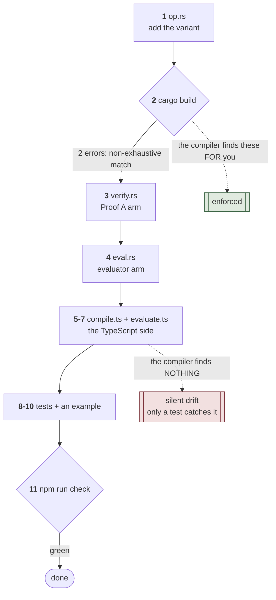

*ride Handbook · Part 8 of 9 — Recipes*

# Add an instruction

**One end-to-end walkthrough of the change most likely to be made next.** Follow it in order. The
order matters, because step 2 is what tells you steps 3 and 4 are still owed.

[Index](README.md) · [1 Overview](01-overview.md) · [2 Language](02-language.md) ·
[3 Compiler](03-compiler.md) · [4 Bytecode](04-bytecode.md) ·
[5 Verification](05-verification.md) · [6 Runtime](06-runtime.md) ·
[7 Testing](07-testing.md) · **8 Recipes** · [9 Roadmap](09-roadmap.md)

---

## Contents

- [01 · The walk](#01--the-walk)
- [02 · Worked: add a `Floor` instruction](#02--worked-add-a-floor-instruction)
- [03 · Why the order is what it is](#03--why-the-order-is-what-it-is)
- [04 · Shorter recipe: add a builtin that already has an instruction](#04--shorter-recipe-add-a-builtin-that-already-has-an-instruction)
- [05 · The checklist](#05--the-checklist)

---

## 01 · The walk

```
  Recipe: add an instruction
    1  runtime/src/op.rs        — add the variant               ← the compiler now fails twice
    2  cargo build              — read both errors. They are the to-do list.
    3  runtime/src/verify.rs    — the stack effect, in verify_func (Proof A)
    4  runtime/src/eval.rs      — the evaluator arm
    5  src/compile.ts           — the TypeScript mirror of the variant  ← NO compiler help
    6  src/compile.ts           — emit it: a builtin entry, or an operator, or a form
    7  src/evaluate.ts          — the reference arm                     ← NO compiler help
    8  runtime/tests/runtime.rs — pin the published meaning
    9  test/compile.test.ts     — pin the surface and the emitted bytecode
   10  examples/*.ride          — use it, so the differential harness sweeps it
   11  npm run check            — the gate
```

Steps 1 to 4 are safe. Steps 5 to 7 are where an instruction goes missing.



**Fig 1** Step 2 is the mechanism, not a formality. The two Rust matches are exhaustive with no
wildcard, so `cargo build` names exactly which files still owe an answer.
`runtime/src/verify.rs:178` · `runtime/src/eval.rs:93`

---

## 02 · Worked: add a `Floor` instruction

A unary instruction. It rounds towards negative infinity.

### Step 1 · the variant

`runtime/src/op.rs`, in the builtins block near `:47`:

```rust
    Exp,
    /// Round towards negative infinity.
    Floor,
    Max,
```

### Step 2 · let the compiler tell you what is owed

```
$ cargo build
error[E0004]: non-exhaustive patterns: `Op::Floor` not covered
  --> src/eval.rs:94:15
error[E0004]: non-exhaustive patterns: `Op::Floor` not covered
  --> src/verify.rs:229:15
error: could not compile `ride-runtime` (lib) due to 2 previous errors
```

**Two errors. That is the to-do list for the Rust half.** Do not add a `_` arm to silence them.
Part 4 §02 explains why the wildcard is absent.

### Step 3 · the stack effect, in Proof A

`runtime/src/verify.rs`, in the unary group near `:261`:

```rust
            // Unary: rewrite in place.
            Op::Neg | Op::Sin | Op::Cos | Op::Sqrt | Op::Abs | Op::Sign | Op::Exp
            | Op::Floor => {
                need!(1);
            }
```

`need!(1)` is the guard that makes a malformed program fail at verification instead of indexing
below the stack. Every pop needs one.

### Step 4 · the evaluator arm

`runtime/src/eval.rs`, near `:172`:

```rust
            Op::Floor => {
                stack[top - 1] = stack[top - 1].floor();
                pc += 1;
            }
```

**The `pc += 1` is not optional.** Part 6 §03 says why: the loop runs on an assignable counter, so
an arm that forgets to advance it spins forever on that instruction, and no compiler warning
appears.

At this point `cargo test` passes. The Rust half is complete and the TypeScript half is now wrong,
silently.

### Step 5 · the TypeScript mirror

`src/compile.ts`, in the `Nullary` union near `:47`:

```ts
type Nullary =
    | 'Add' | 'Sub' | 'Mul' | 'Div' | 'Pow' | 'Neg'
    | 'Sin' | 'Cos' | 'Sqrt' | 'Abs' | 'Sign' | 'Exp' | 'Floor'
    …
```

### Step 6 · emit it

For a builtin, one entry in `BUILTINS` at `src/compile.ts:84`:

```ts
    floor: { arity: 1, op: 'Floor' },
```

That is the whole emitter change. `src/compile.ts:342` already walks the arguments and pushes the
instruction for any entry in that table.

### Step 7 · the reference arm

`src/evaluate.ts`, near `:76`:

```ts
            case 'Floor': un(stack, Math.floor); pc++; break;
```

`un` applies the function and rounds through `Math.fround`. `src/evaluate.ts:165`

TypeScript **will** catch a missing case here. The `switch` on `instr.op` ends with an
exhaustiveness check at `src/evaluate.ts:152`, so omitting this step gives:

```
src/evaluate.ts(152,23): error TS2322: Type '{ op: Nullary; }' is not assignable to type 'never'.
```

Step 5 is the step with no safety net at all.

### Step 8 · pin the published meaning

`runtime/tests/runtime.rs`:

```rust
#[test]
fn floor_rounds_towards_negative_infinity() {
    // The direction matters at a negative value: -2.5 floors to -3, not to -2.
    assert_eq!(eval(vec![Op::Push(2.7), Op::Floor, Op::Ret], &[]), 2.0);
    assert_eq!(eval(vec![Op::Push(-2.5), Op::Floor, Op::Ret], &[]), -3.0);
}
```

Part 7 §05 is the reason this step is not optional. An instruction with no example is invisible to
the differential harness, so a unit test that pins its meaning is the only protection it has.

### Step 9 · pin the surface

`test/compile.test.ts`:

```ts
test('floor', async () => {
    expect(run(await build('let main = floor(-2.5)'))).toBe(-3);
});
```

### Step 10 · give the harness something to sweep

Add a use to an example in `examples/`, then regenerate:

```bash
npm run build && node scripts/differential.mjs
```

### Step 11 · the gate

```bash
npm run check
```

---

## 03 · Why the order is what it is

| Step | Could it move? | Why not |
|------|----------------|---------|
| 1 before 2 | no | The variant must exist for the compiler to report it missing. |
| 2 before 3 and 4 | no | Step 2 **is** the list of what 3 and 4 owe. Skipping it means guessing. |
| 3 before 4 | yes, but | Proof A is what makes the evaluator's unchecked indexing safe. Writing the evaluator first invites an arm with no guard behind it. |
| 5 before 6 | no | `BUILTINS` is typed against `Nullary`, so the emitter will not compile first. |
| 8 before 10 | yes | Both are tests. The unit test is the one that survives an example being deleted. |
| 11 last | no | It is the gate. |

> ### The two steps the compiler cannot help with
>
> Steps 3 and 4 are enforced. `cargo build` fails until both are answered, because
> `runtime/src/verify.rs:178` and `runtime/src/eval.rs:93` match `Op` with no wildcard.
>
> **Step 5 has no such help.** `src/compile.ts:37` is a separate TypeScript union. Nothing links
> it to the Rust enum, so a missing variant there is not an error anywhere. The front end simply
> cannot express the new instruction, and the failure is a feature that quietly does not work.
>
> Step 7 is protected. `src/evaluate.ts:152` assigns the instruction to `never` in the default
> arm, so once step 5 adds the name, `tsc` demands the arm. The error text is in step 7 above.
>
> So the risk is concentrated in exactly one step. Part 1 §05 row 1 records it as a drift risk,
> and Part 9 lists generating the TypeScript union from the Rust enum as a to-do.

---

## 04 · Shorter recipe: add a builtin that already has an instruction

Nothing to add to the runtime. Two files.

```
  Recipe: expose an existing instruction as a builtin
    1  src/compile.ts     — one entry in BUILTINS (src/compile.ts:84)
    2  test/compile.test.ts — assert its value and its arity error
    3  npm test
```

For example, `Select` is in the instruction set and is reachable from the surface as
`select(edge, x, a, b)`. If it were not, adding it would be exactly these three steps.

---

## 05 · The checklist

Run this against the diff before presenting it.

- [ ] `cargo build` produced **no** `_` wildcard arm anywhere.
- [ ] The stack effect in `verify_func` matches the number of pops in the evaluator arm.
- [ ] The evaluator arm advances `pc`.
- [ ] Every pop in the new arm has a matching `need!(n)` in Proof A.
- [ ] `src/compile.ts` and `runtime/src/op.rs` list the same instruction set.
- [ ] `src/evaluate.ts` has an arm, and it rounds through `Math.fround`.
- [ ] A unit test states the instruction's published meaning, including a sign or boundary case.
- [ ] An example uses it, and the differential test was regenerated.
- [ ] `npm run check` is green.
- [ ] Part 4's instruction table was updated, and the count in its §08 still matches.

---

> Sources read for this part: `runtime/src/op.rs`, `runtime/src/verify.rs` lines 178–340,
> `runtime/src/eval.rs` lines 93–290, `src/compile.ts` lines 37–120 and 340–350,
> `src/evaluate.ts` lines 47–170, `runtime/tests/runtime.rs`, and `test/compile.test.ts`.
>
> **This recipe was executed, not drafted.** The `Floor` instruction was added through all eleven
> steps on **2026-10-03**, and the change was then reverted. The `cargo build` output in step 2
> and the `tsc` error in step 7 are both real transcripts. `floor(2.7)` gave `2`,
> `floor(-2.5)` gave `-3`, and `floor(-0.1)` gave `-1`. The gate was green before and after.
>
> Line references point at the source as read on **2026-10-03**.
> **Names and rules are stable. Line numbers move.**
