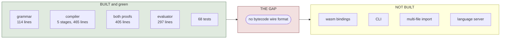
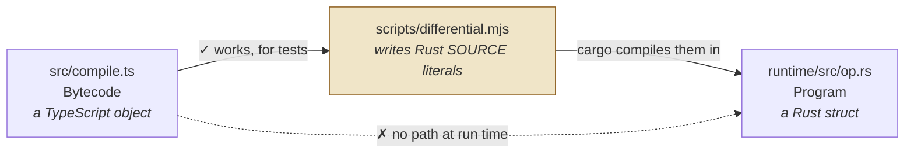
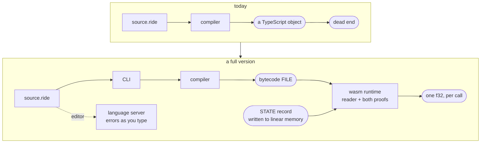

*ride Handbook · Part 9 of 9 — Roadmap*

# Done, missing, and next

**What exists today, what a full version needs, and the order to build it in.** This part is the
only one that describes work rather than code.

[Index](README.md) · [1 Overview](01-overview.md) · [2 Language](02-language.md) ·
[3 Compiler](03-compiler.md) · [4 Bytecode](04-bytecode.md) ·
[5 Verification](05-verification.md) · [6 Runtime](06-runtime.md) ·
[7 Testing](07-testing.md) · [8 Recipes](08-recipes.md) · **9 Roadmap**

---

## Contents

- [01 · Where the project stands](#01--where-the-project-stands)
- [02 · The one blocking gap](#02--the-one-blocking-gap)
- [03 · What a full version needs](#03--what-a-full-version-needs)
- [04 · Done](#04--done)
- [05 · To do, in order](#05--to-do-in-order)
- [06 · Known limits, with their causes](#06--known-limits-with-their-causes)
- [07 · The decision that blocks the value representation](#07--the-decision-that-blocks-the-value-representation)
- [08 · Deliberately not planned](#08--deliberately-not-planned)

---

## 01 · Where the project stands



**Fig 1** The two halves are complete and tested. Nothing serialises between them, so the project
cannot yet deliver a compiled program to the runtime it was built for.
`scripts/differential.mjs:1` · `package.json:25`

**68 tests pass**, measured on 2026-10-03: 39 front-end, 26 runtime, 2 differential, 1 doctest.

| Half | State | Evidence |
|------|-------|----------|
| Front end | Complete for the current language | 39 tests, exact bytecode assertions |
| Runtime | Complete | 26 tests, including 13 malformed-bytecode rejections |
| The seam between them | **Missing** | `npm run build:wasm` produces a module with zero exports |

---

## 02 · The one blocking gap

The compiler emits a TypeScript object. The runtime consumes a Rust struct. **Nothing serialises
between them.**



**Fig 2** The only bridge today writes Rust source text, which `cargo` then compiles. That works
as a test harness and cannot work as a delivery path, because it needs a Rust compiler at the
moment a program is loaded. `scripts/differential.mjs:27`

Three consequences, all measured:

| Consequence | Evidence |
|-------------|----------|
| `npm run build:wasm` builds a 362-byte module with **zero exports** | The crate carries no `#[wasm_bindgen]` item. `runtime/Cargo.toml:12` makes the dependency optional and nothing uses it. |
| No program can be loaded from a file or a network | There is no reader, so `Program` can only be built by Rust code that names every instruction. |
| The proofs are never exercised on real untrusted input | They are tested with hand-built literals. That is the right test, and it is not the real path. |

**This is the first roadmap item.** Everything else in §05 is easier once it exists.

---

## 03 · What a full version needs

A full version is not a bigger language. It is the same language with the surrounding parts built.



**Fig 3** The shape a full version takes. Each new box is a roadmap item in §05, and the order of
the boxes is the order to build them. `package.json:25`

| Part | Why it is needed | Size |
|------|------------------|------|
| A bytecode wire format | The only way a compiled program reaches the runtime | Medium. See §05 item 1 for the design question. |
| `#[wasm_bindgen]` bindings | The only way a browser or Node host calls the runtime | Small, once the format exists |
| A CLI | Compile a file without writing a script | Small |
| Multi-file `import` | The grammar already accepts it. Part 2 §08. | Medium |
| A language server | Errors in an editor rather than in a terminal | Large. Langium gives most of it. |

---

## 04 · Done

| Area | What works | Where |
|------|-----------|-------|
| Grammar | `state`, `let f a =`, `let … in`, `if/then/else`, 5 comparisons, implicit multiplication, comments | `src/ride.langium` |
| Compiler stages | collect, check, acyclic, emit, link | `src/compile.ts:120` |
| Diagnostics | 14 distinct messages, 15 `errors.push` sites | `src/compile.ts` |
| First-order rule | Two messages: a function used as a value, and a number called | `src/compile.ts:271` and `:360` |
| No-recursion rule | Cycle found by name, reported as `a → b → a` | `src/compile.ts:417` |
| Instruction set | 31 instructions | `runtime/src/op.rs:20` |
| Proof A | Height table, checked at the target. Also the index and underflow checks. | `runtime/src/verify.rs:178` |
| Proof B | Cycle rejection plus DAG longest path | `runtime/src/verify.rs:344` |
| Evaluator | One pass, three fixed arrays, zero allocation, no panic path | `runtime/src/eval.rs:83` |
| Error set | 20 verify codes, 1 eval code, all distinct | `runtime/src/verify.rs:44` |
| Reference evaluator | A TypeScript twin, `f32`-rounded | `src/evaluate.ts:28` |
| Differential harness | 802 samples across 2 examples | `scripts/differential.mjs` |
| The gate | `npm run check` runs both suites | `package.json:26` |

---

## 05 · To do, in order

### 1 · A bytecode wire format — **blocking**

A writer in `src/compile.ts` and a reader in a new runtime module.

| Decision owed | Options | Recommendation |
|---------------|---------|----------------|
| The encoding | A fixed-width record per instruction, or a variable-length tag plus payload | **Fixed-width.** 8 bytes per instruction covers every immediate, and a fixed stride means the reader needs no length table. The cost is wasted bytes on nullary instructions. |
| Versioning | A magic number plus a version, or nothing | **Both a magic number and a version.** The instruction set will change, and a reader that misreads an old file silently is the worst failure here. |
| Where the proofs run | In the reader, or after it | **After.** Keep the reader dumb: parse bytes into `Program`, then call `Verified::new`. Two jobs, two places. |

The reader takes untrusted input, so it owes its own error codes for a truncated or malformed
file. Those are decode errors and sit beside the 20 verify codes, not inside them.

### 2 · The `#[wasm_bindgen]` surface

Three entry points, and no more.

```
  load(bytes)        → a handle, or a decode/verify error code
  bounds(handle)     → the stack / frame / calls numbers
  eval(handle, ptr)  → one f32, reading the STATE record from linear memory at ptr
```

The STATE record crosses once per call, as a run of `f32` written by the host. Part 6 §07 holds
the one error this surface can produce at call time.

### 3 · A CLI

`ride compile foo.ride -o foo.rbc`. One command, reading `src/index.ts:71`.

### 4 · Multi-file `import`

The grammar accepts `import { a } from "./lib.ride"`. The compiler ignores it, so the names come
back as unknown. Part 2 §08 shows the message.

| Decision owed | Options | Recommendation |
|---------------|---------|----------------|
| Who reads the file | The compiler, or a resolver the host supplies | **A resolver callback.** `src/index.ts` touches no filesystem today, which is what lets the same entry point serve a test and a browser editor. Keep that. |
| Cycle policy for files | Reject, or allow with a topological order | **Reject.** A file cycle is the same class of problem as a call cycle, and the project already rejects one of those. |

### 5 · An exponent form for numbers

`src/ride.langium:112` accepts no exponent. `1e6` parses as `1 * e6` and produces a confusing
error. Part 2 §07 has the full behaviour.

This is a small grammar change with one risk: `1e6` currently has a meaning, so the change is not
purely additive. A program that multiplies by a variable called `e6` would break.

### 6 · Generate the TypeScript instruction union from the Rust enum

Part 1 §05 row 1 is the only drift risk with no compiler help. Part 8 §03 shows that step 5 of the
recipe has no safety net.

A build step that reads `runtime/src/op.rs` and writes the `Nullary` union would close it. The
cost is a code generator in the build, and a developer who edits the generated file by mistake.

### 7 · Property-based testing over generated programs

Part 7 §05 names this gap. The suite tests the malformed shapes somebody thought of.

Generate random instruction sequences, and assert one thing: **`verify` either rejects, or `eval`
returns without a panic.** That is the whole property, and it is the one that matters.

### 8 · Frame-slot reuse

`src/compile.ts:311` never reuses a slot, so two `let` bindings in two different branch arms take
two slots. Part 3 §06 shows the layout.

**Do not build this yet.** `MAX_FRAME` is 64 and no program comes close. Build it when a real
program hits the limit, and not before.

---

## 06 · Known limits, with their causes

| Limit | Cause | Workaround today |
|-------|-------|------------------|
| No exponent in a number | `src/ride.langium:112` | Write `1000000` in full |
| `import` is ignored | `src/compile.ts:120` never reads `ImportDecl` | Put every function in one file |
| No comparison chaining | `src/ride.langium:81` uses `?`, deliberately | Write `a < b` and `b < c` with no joining operator — there is no `and`, so this needs `min`/`max` arithmetic |
| No boolean operators | Not in the grammar | A truth value is `1.0` or `0.0`, so `min(a, b)` is `and` and `max(a, b)` is `or` |
| No recursion | Proof B's premise. Part 5 §03. | Unroll by hand, or restructure as a closed form |
| One number type | Part 1 §07, undecided | `1/3` is `0.333…`, never `0` |
| 64 frame slots | `MAX_FRAME` | Fewer `let` bindings per call path |
| The wasm module exports nothing | §02 | None. This is the blocking gap. |

> ### There is no `and`, and the language still has boolean logic
>
> The grammar has no `&&` and no `||`. That looks like a missing feature.
>
> A comparison returns `1.0` or `0.0` (Part 4 §06). So `min` and `max` already do the work:
>
> ```ride
> let both  a b = min(a, b)     // and
> let either a b = max(a, b)    // or
> let negate a = 1 - a          // not
> ```
>
> This is honest arithmetic, not a trick. `min(1.0, 0.0)` is `0.0`, which is false.
>
> **What it does not give is short-circuit evaluation.** Both arguments are always evaluated,
> because the language is strict. For a total language that is only a cost question, and §08
> explains why no short-circuit form is planned.

---

## 07 · The decision that blocks the value representation

**One number type, or `int` and `float`?** This is the owner's call, and it is the only item in
this part that another decision depends on.

| If | Then the value representation is | And |
|----|----------------------------------|-----|
| One number type | A bare `f32`, no tag | The runtime keeps no trap path. Today's state. |
| `int` and `float` | An `f32` plus a tag, or two instruction families | Integer division can trap, so the language must answer what `1/0` does |

The reason the second row is a one-way door: `f32` division by zero gives an infinity, and
**`i32.div_s` traps.** A trap is a panic on the evaluation path, which Part 6 §06 lists as a
guarantee the runtime currently makes.

Three answers exist. Each costs something different.

| Answer | Cost | What it keeps |
|--------|------|---------------|
| Forbid integer division | A language with `int` that cannot divide it | No trap, no analysis |
| Define `int` division to return a value | A rule nobody expects. What is `1/0`? | No trap, no analysis |
| Prove the divisor is non-zero at compile time | A dataflow analysis in `src/compile.ts` | No trap, and no surprising rule |

**Recommendation:** keep one number type until a real program needs integer semantics. The surface
leaves room for the ML answer — distinct operators per type, `+` against `+.` — so the upgrade
path stays open. `CLAUDE.md` §10 records the same decision under *The open decision*.

---

## 08 · Deliberately not planned

Each row is a thing a reader might expect, with the reason it is absent.

| Not planned | Why | What would change the answer |
|-------------|-----|------------------------------|
| Lambdas and higher-order functions | The first-order invariant buys direct calls, no closures, and unambiguous implicit multiplication. Part 1 §04. | A real program that needs to pass a function. Then read Part 1 §04 before building it, because the grammar change is the small half. |
| Recursion | Proof B's premise. Part 5 §03. | A program that needs it. The cost is the frame bound, and a depth limit would have to replace it. |
| Lazy evaluation | A thunk is a heap object, and the runtime has no allocator. | Nothing in sight. A strict language with no effects loses little. |
| Short-circuit `&&` and `||` | Every expression in the language is total, so skipping an arm saves time and changes no result. | Integer division. A trapping arm would make short-circuiting a correctness feature, not a cost feature. |
| Strings, arrays, records as values | The language computes one number. Part 1 §01. | A different project. |
| An algebraic simplifier | It reassociates, and `f32` addition is not associative. Part 3 §01. | A measured need. The gate is a bit-for-bit comparison over every example. |
| A garbage collector | Nothing allocates. | Any of the three rows above it. |

> ### The invariants are not preferences, and that is why this table is short
>
> Each "not planned" row above traces to one of the four invariants in Part 1 §04, and each
> invariant is the premise of a proof.
>
> So a feature request here is not a matter of taste. **Adding lambdas means answering what
> replaces the direct-call guarantee. Adding recursion means answering what replaces Proof B.**
>
> That is a higher bar than a normal backlog, and it is deliberate. The bar is what keeps the
> evaluator at 297 lines with no allocator and no panic path.
>
> It is not a veto. It is a price, and the owner sets it.

---

> Sources read for this part: `package.json`, `runtime/Cargo.toml`, `src/ride.langium`,
> `src/compile.ts`, `src/evaluate.ts`, `src/index.ts`, `runtime/src/op.rs`,
> `runtime/src/verify.rs`, `runtime/src/eval.rs`, `scripts/differential.mjs`, `.gitignore`,
> `.claude/tasks/_index.md`, and `CLAUDE.md` §10.
>
> The test counts in §01 come from a full `npm run check` run on **2026-10-03**. The 362-byte
> figure and the zero-export finding in §02 come from running `npm run build:wasm` and inspecting
> `dist/ride_runtime.js` on the same date. The boolean-arithmetic forms in §06 were derived from
> the comparison semantics in `runtime/src/eval.rs:223-248`.
>
> Line references point at the source as read on **2026-10-03**.
> **Names and rules are stable. Line numbers move.**
